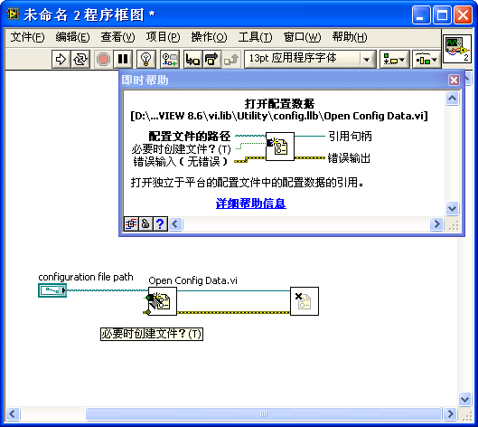
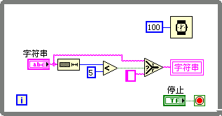
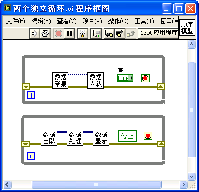
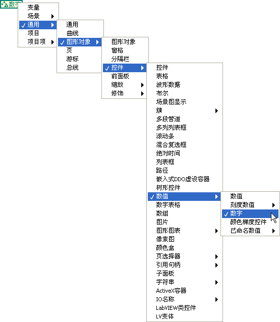

# 控件和数据在程序中的使用

## 控件与变量的关系

熟悉文本编程语言的用户一定非常熟悉变量这个概念。变量是文本编程语言中一个非常重要的元素，程序所需的数据都存储在变量中。但是，在使用LabVIEW语言的时候，必须改变这种观念。

LabVIEW中并没有与文本编程语言中的变量直接对应的概念。虽然，有一些其它的对象可以完成文本编程语言中变量的功能。

有过文本编程语言经验，而又初学LabVIEW的用户，常常会把LabVIEW中的控件当作文本编程语言中的变量：变量是用来保存数据的，而控件中也可以保存数据，所以控件可以当作变量用。这种思维方式在LabVIEW编程中，虽然也行得通，但是它并不符合LabVIEW最本质的数据流驱动模式。在这种思维方式的指导下，写出来的程序往往代码混乱，不易阅读，容易出错。

其实，控件在LabVIEW程序中主要是用来输入输出数据的：一是作为用户界面，与用户交互；二是在子VI中用于与上层程序交换数据。子VI中的控件的功能就类似于文本编程语言中子函数的参数。

那么，在LabVIEW中是什么最接近于文本编程语言中的变量呢？那就是数据连线了。在LabVIEW程序框图中，数据从某一节点流出，经由数据线，再流入下一节点。暂且不考虑LabVIEW内部是如何实现这一机制的，单从编程者的角度直观来看，数据从某节点流出后，暂时保存在一数据线内，再被传递给下一个节点。所以，一条数据线就类似于文本编程语言中一个生命周期极短的变量。从某一子函数返回的数据也保存在数据连线这个变量中，直到把数据传递给下一个函数，这个变量的生命周期也就结束了。

因此，在编写LabVIEW代码的时候，遇到一个数据从某节点传出，需要暂时保存一下，留给后续某个节点使用的情况时，先不要考虑给这个数据新建一个控件或者全局变量来保存它，而是应该考虑如何连一条数据线，把数据引出，再传递到需要使用它的那个节点。

## 控件的标签和标题

LabVIEW的控件有标签和标题这两个非常相似的属性，二者的共同点都是为了给控件一个有意义的名称；它们的主要区别是：

标签是控件唯一的标识，每个控件的标签应当是唯一的。标签在程序运行过程中是不可以改变的。LabVIEW提供的某些高级函数可以在程序运行时，根据控件的标签，找到一个控件，并对其操作。尽管LabVIEW并没有禁止给不同的控件使用同一标签名，但这种编程习惯极其有害，会为程序留下隐患。因此，编程时一定要注意，控件不能使用同一VI上重复的标签，或空白标签。

标题更侧重的是界面上显示出来的名称，是可以在运行时改变的。有些控件在程序中可能有多个含义，在表示不同含义时需要给予不同的文字提示。此时，就可以在界面上显示控件的标题，并在程序中动态对其进行修改。标题的另一个重要用途是为了软件本地化的需要。标签作为控件的唯一标识，在程序的各种语言版本中都应当相同，而能够改变的文字就是标题了。所以，需要本地化的软件，应当把控件的标签隐藏起来，而显示其标题。

刚从控件选板拖到VI前面板上的控件是没有标题的，它只有一个标签。在控件右键菜单的"显示项"中选中"标题"，这时，LabVIEW会自动给控件添加一个内容与标签相同的标题，并显示出来。当然，也可以在控件的属性对话框中配置控件显示的标题或标签。

推荐大家按照下面的规范在VI中使用控件的标签和标题。

先给VI分一下类：

    1. 底层VI：用户不会直接使用到的VI，作为子VI随程序一起发布。

    2. 用户界面VI：VI前面板是用户所看到的程序界面的一部分。

    3. 程序接口VI：VI是提供给用户编程时，当作API被调用的。

对于标签和标题而言，一个共同的书写规范是：使用有意义的文字。在使用英语短语命名时，单词之间可用空格分隔，不应该有重名。

不同点列于表 2.3。

<table>
<colgroup>
<col style="width: 16%" />
<col style="width: 35%" />
<col style="width: 47%" />
</colgroup>
<tbody>
<tr class="odd">
<td><strong>VI类型</strong></td>
<td><strong>标签</strong></td>
<td><strong>标题</strong></td>
</tr>
<tr class="even">
<td>底层VI</td>
<td>显示来</td>
<td>使用LabVIEW的默认状态，即标题为空。</td>
</tr>
<tr class="odd">
<td>用户界面VI</td>
<td>
隐藏

多语言版本中，只使用英语
</td>
<td>
显示

多语言版本中，使用本地化语言
</td>
</tr>
<tr class="even">
<td>程序接口VI</td>
<td>
隐藏

多语言版本中，只使用英语 
不用标注控件的默认值
</td>
<td>
显示

多语言版本中，使用本地化语言 
在后面加一括号，括号内标注控件的默认值和数据单位
</td>
</tr>
</tbody>
</table>

表 .3标签和标题在不同VI中的用法

## 控件的默认值

在VC++等编程语言中，你可以运行一个程序，但是不能运行一个函数。这给调试带来了麻烦。比如，你编写了一个子函数，想立即调试一下。可是，为了调试，还必须先创建一个完整的工程，实现main()函数。然后，在main()函数中定义必要的变量，传参数给要测试的子函数，再调用子函数。调试相当繁琐。

相比之下，LabVIEW在这方面就具有很大优势。LabVIEW中的每个VI都可以独立运行。当然，为了让一个VI正确运行，还要为它提供合理的参数输入。

在运行之前，给VI前面板上的控制控件赋予合理的值，VI就会使用这些值来运行程序。LabVIEW的每个控件都有一个默认值。比如，新拖到VI前面板上的数值控件的默认值是0。即使你改动了这个值，关闭VI，当重新打开这个VI时，控件又会回复到默认值。如果一个数值控件最经常使用的值不是0而是0.5，那么就应该把0.5设置为它的默认值。为此，必须先把控件的值设为0.5，再从控件的鼠标右键菜单中选择"数据操作-\>当前值设置为默认值"，控件的默认值就被设置成了0.5。下次再打开VI，看到这个控件的值就是0.5。

当VI作为子VI时，控制控件被用作子VI的输入参数。上层程序调用一个子VI时，并不需要给子VI的每个参数都输入一个值。如果上层程序没有输入，子VI就使用控件的默认值作为输入参数。所以，为了便于调用，子VI应当选择最常用的值作为控件的默认值。还可以把控件的默认值写在控件的标签或标题上，以便查看。

例如，图 2.52的程序中使用了"Open Config
Data.vi"子程序，从即时帮助中，可以看到，该子VI的"必要时创建文件"参数的默认值是"真（T）"。程序的需求与此相同，所以不必再传一个"真"数据给这个参数了。也就是说，这个输入端不必连任何数据，子VI运行时自然会使用这个默认的"真"值。

图 .52调用子VI时，使用子VI参数的默认值

## 局部变量

### 创建局部变量

在控件或控件的接线端上点击鼠标右键，选择"创建-\>局部变量"，可以为控件创建出一个局部变量来。

局部变量在程序框图上显示为一个双线边框的矩形，矩形内的文字是控件的标签名。局部变量中的数据等同于控件中的数据。控件中数据改变，局部变量中的数据也会随之改变；反之亦然。

与控件的接线端不同，不论控件是哪种方向的（即无论是控制控件还是显示控件），它的局部变量既可以用作读出数据，也可以用作写入数据。在局部变量的右键菜单上选择"转换为读取/转换为写入"，可以改变局部变量的数据流入/流出方向。

局部变量给编程者提供了一个获得数据的便利条件：既不用从接线端连线，也不受接线端方向的限制。想读就读，想写就写。因此，局部变量很容易被初学者滥用。尤其是有文本编程经验的用户，很容易把控件的局部变量与文本编程语言中的变量混淆起来，把它当作存储和传递数据的工具。但是，正如在第2.4.1节所介绍的，子VI的控件是用于与高层程序或用户交互数据的，而不是用于暂存和传递VI运行中产生的临时数据的。控件局部变量的用途与控件相同，只是起辅助作用。在VI内部传递数据的功能应当由数据连线完成，只有在不得不使用局部变量的情况下，才应该考虑使用它。

一般，在下列情况中，可以考虑使用局部变量。

### 把数据写入控制控件，或从显示控件读取数据

图
2.53所示的程序框图的功能是：界面上有一字符串型控制控件，若输入的文字少于或等于4个字母时，正常显示；否则，清空字符串控件。由于控制控件的接线端只能作为数据源，不能写入数据。所以，在需要更新控件内容的时候，需要使用局部变量。同理，从显示控件中读取数值，也需要使用局部变量。

图 .53使用局部变量设置控制控件的值

在这个例子中，"字符串"控件必须在其鼠标右键菜单中被设置为"键入时刷新"。这样，每输入一个字符，程序都会自动检查一下，看看当前字符串的值是否需要做修改。否则，程序会等到用户在字符串控件上输入完所有字符后，才更新字符串控件的值。

### 应用于多线程间的共享数据

{width="4.0625in" height="3.90625in"}

图 .54使用一个控件停止两个循环

在图
2.54所示的程序框图中，有两个完全独立的循环。由于它们之间没有数据线连接，LabVIEW就认为可以并行运行这两个循环。实际上，此程序的目的也是要同时运行这两个循环，分别完成不同的工作。在用户点击"停止"按钮后，两个循环同时停下来。

LabVIEW会把两段没有先后顺序要求的代码，放在不同的线程内，同时运行它们。线程是一个计算机科学术语，指运行中的程序的调度单位。一个线程就是程序中一个单一顺序的控制流。这里采用一种不很确切但容易接受的理解方法：在LabVIEW中，一段程序执行的代码就构成了一个线程，另一段代码与这段代码无先后依赖关系，同时也在运行，就是另一个线程。（关于多线程的详细内容，将在第11.3节中讲述。）

在这个程序中，"停止"控件的接线端控制了一个循环的结束条件，它的局部变量控制了另一个循环的停止条件。按下"停止"按钮，局部变量中的数据也会同时更新，于是两个循环的停止条件接线端都收到了同样的"真"数据，两个循环都停止运行。

要在多个线程中同时使用同一个数据，就需要使用局部变量来解决。

图
2.55中的程序框图并没有使用局部变量，而是使用了数据连线。从"停止"按钮读出的数据被分别连接到两个循环的停止条件的输入端。这个程序中了两个循环会同时运行同时停止吗？

图 .55数据线连接两个循环

LabVIEW的循环体具有如下特点：若有数据从循环外流入循环体内，则程序认为循环体内既然需要这一数据，就只有等接收到这一数据后，循环才能开始迭代运行；若有数据流出循环体，程序考虑到每一次循环迭代，其数据都可能发生变化，所以只有当循环结束才能输出一个最终的确定值。

图
2.55中有一根数据线从上方循环体内，引到循环体外，再引入到下方另一个循环体内。也就是说，下面这个循环需要上面那个循环的输出值，两个循环间形成了顺序上的依赖关系。实际运行程序时，框图上面的循环会先开始运行，直到用户点击"停止"按钮，循环结束，才能把"停止"控件的值传递出循环体。"停止"数据流入下方的循环，下方的循环才开始迭代运行。由于这个"停止"值是"真"，下方循环迭代一次即停止。这样的运行逻辑就不可能完成设计中让两个循环同时运行的功能。也就是说，图
2.55所示的程序是不具备图 2.54的功能的。

## 属性节点

控件的属性，比如数值的界限、显示格式等，可以在控件的属性对话框中配置。但是，属性对话框只涵盖了控件属性中的小部分，它的大部分的属性并未包括在属性对话框内。但是，我们可以通过程序来查看或设置这些属性。

在控件或控件的接线端上点击鼠标右键，选择"创建-\>属性节点"，然后选择其中一项，即可得到该控件的一个属性。每一个控件都拥有很多属性。例如，图
2.56是一个普通数值控件的属性，它的属性的个数还算是比较少的，但也有数十个之多。初学者要记住所有的属性不太容易，好在LabVIEW有即时帮助功能。在选择属性节点时，可以打开LabVIEW的即时帮助窗口，鼠标移动到不同的属性上，即时帮助窗口上就会显示出该属性的解释。

图 .56普通数值控件的属性

在选择属性时，属性候选菜单是按照属性所属类别来排列的。以图
2.56显示的属性为例，除去"浏览"项，排在最上面一栏的是LabVIEW中所有对象都具备的属性；紧接在下面的一栏是所有VI前面板对象都具备的属性；再下面一栏是所有控件都具备的属性；再下面的是所有数值类型控件的属性；最下面的是我们选择的这一数值控件的属性。每一类别之中，则是按字母顺序排列。记住排列的类别，有助于我们寻找所需的属性。

有一个好方法，可以帮助我们查看LabVIEW对象的这种类型的层次关系：在程序框图上创建一个"编程-\>应用程序控制-\>类说明符常量"，然后鼠标点击这个常量，菜单展开的层次，就是LabVIEW中对象从通用到特定的层次关系（图
2.57）。

图 .57对象类型从通用到特定的层次关系

有些属性是只读或只写的，有些则既可读也可写。在属性的右键菜单中可以选择"全部转换为写入"/"全部转换为读取"，或"转换为写入"/"转换为读取"，以改变属性的方向。有的属性虽然可写，但只有当VI在编辑状态下，才可以改变属性的值，比如控件的标签文本便是如此。所以，在尝试设置控件属性时还要注意属性节点是否返回错误。当然，在帮助文件中都可以找到有关属性项的详细说明。

一个属性节点可以同时读写多个属性。把鼠标移到属性节点下边框的中间部位，就可以将其拉长或缩短（图
2.58）。鼠标点击新增出来的条目，可将其更换为我们需要的属性。鼠标菜单中，还有"增添元素""删除元素"选项，也可以完成上述功能。

图 .58拉长属性节点，添加新属性

在属性项中，有一项名为"值"，其作用相当于上一节提到的局部变量。但是程序运行时，属性节点的效率要大大低于局部变量。另一项名为"值（信号）"的属性则是用来作为该控件发出"值改变"事件信号的，对于事件的处理会在本书第3.7节介绍。

属性节点默认显示的是每个属性的短名称，即英文缩写。在属性节点的右键菜单中可以把它切换成长名称显示，这样就可以使用中文名称了（图
2.59）。

图 .59属性节点的名称格式

## 调用节点

调用节点的创建、使用方法与属性节点类似。区别在于调用节点用于选择方法，以完成控件的某些行为。每个调用节点只能选择一种方法。

在控件的接线端上点击鼠标右键，选择"查找-\>控件"，可以高亮显示接线端对应的控件。在程序中，也可以通过调用节点来实现这个功能。为控件创建一个"对象高亮显示"调用节点，运行程序，就可以看到控件被高亮显示了一次（图
2.60）。

{width="0.75in" height="0.40625in"}

图 .60"对象高亮显示"调用节点

本书在第6章还将对属性节点和调用节点做更详细的阐述。