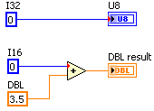
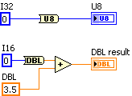
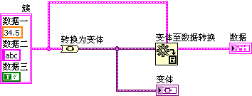
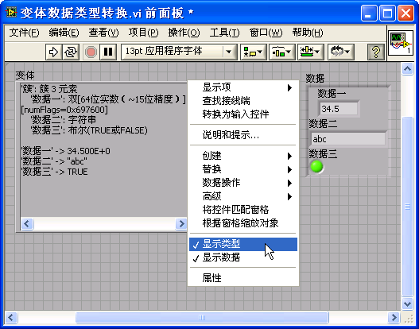
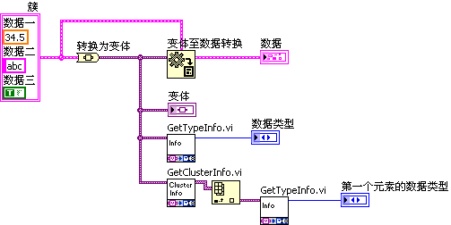
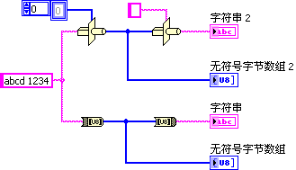
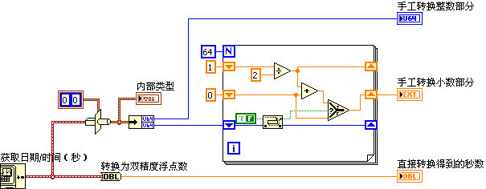
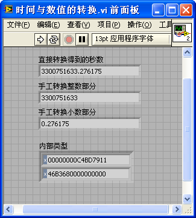

## 数据类型间的转换

### 数值表示法之间的转换

数值表示法之间，通常不需要经过特殊函数进行转换。用连线把一个数值，连接到另一种表示法数值类型的接线端上，数据就会自动转换成新的表示法。有些函数，如加法函数，可以接受任何表示法的数据。若有两个不同表示法的数据作为加数传递给加法函数，加法函数会把表示范围较小的那个数据转换为范围较大的表示法，结果数据当然也采用后一种表示法。数据表示法发生变化的地方会出现一个红点（强制转换点），以提醒编程者的注意（图
2.36）。

图 .36发生表示法转换

一般来说，这些强制转换点并不会影响程序运行。但它们毕竟是编程时无意识造成的，有可能存在潜在危险。比如编程者不小心使用了一个短数据类型来显示一个原本是长数据类型的数据，就有潜在的数值溢出的可能。所以，为了消灭这些潜在威胁，应当消除所有的强制转换点。如果程序中确实需要进行强制转换，可以使用表示法转换函数（在函数选板"编程-\>数值-\>转换"中）（图
2.37）。这样一来，可以避免无意识下造成的数值转换错误。

图 .37使用数值转换函数

### 数值与字符串之间的转换

数值和字符串之间经常需要进行转换。通常，数据在进行计算的时候必须使用数值，而显示的时候又往往是以字符串的形式表示。数值和字符串之间转换的函数位于函数选板"编程-\>字符串-\>字符串/数值转换"上。二者之间的相互转换都要根据数值是何种进制、是否小数或指数等情况选择相应的函数。

"编程-\>字符串"
函数选板上还有两个功能更加强大的转换函数："格式化写入字符串"和"扫描字符串"。这两个函数的功能相当于C语言中的sprintf()和sscanf()。与其它转换函数相比，它们可以一次处理多个数据，并且以更丰富的形式表现。但是使用这两个函数需要编程者仔细阅读该函数的帮助文件，了解掌握格式字符串语法。

前文曾提到，字符串中的数据是用U8的数值数组表示的，每个字符用一个U8数值表示，U8数值就是该字符的ASCII码。使用"字符串至字节数组转换"函数（）就可以把字符转换成U8数组，显示出各字符的ASCII码。

### 数值与布尔类型之间的转换

数值与布尔类型之间的转换不需要特殊的函数，通过一个简单的程序就可完成转换功能（图
2.38）。

{width="2.875in" height="0.4375in"}

图 .38数值与布尔之间的转换

### 路径与其它数据类型的转换

与路径转换相关的转换函数都位于函数选板"编程-\>文件I/O-\>高级文件函数"上。最常用的是路径与字符串类型之间转换的两个函数："路径至字符串转换"和"字符串至路径转换"。

另外，前文提到，路径数据内部包含两部分信息：一是路径种类，二是每级文件夹名字组成的字符串数组。可以使用"路径至字符串数组转换"和"字符串数组至路径转换"函数在路径与字符串数组这两种数据之间转换。

"引用句柄至路径转换"函数可以从文件的引用句柄中得到文件路径信息。比如，可以利用这个函数，可以把"打开/创建/替换文件"中各函数输出的句柄转换为路径，还可以得到TDMS文件的路径。但由于LabVIEW中对每种文件的打开机制不一样，这个函数并不适用于LabVIEW文件类型。例如，不能用它得到LabVIEW中使用"打开配置数据"VI打开的INI文件的路径。

### 与时间相关的转换

在LabVIEW中，时间的表达可以使用一个专门的数据类型："时间标识"。在LabVIEW内部，以秒为单位记录时间。LabVIEW使用了两个64位数值来记录时间的值。前64位记录秒数的整数部分，后64位记录小数部分。它的长度与扩展精度实数一样，但表示方法并不相同。

时间有两种：相对时间和绝对时间。相对时间表示某两个时刻之间的差值，这个数据在LabVIEW中记录的就是两个时刻所差的秒数。绝对时间指的是某一时刻的年月日时分秒，在LabVIEW中记录的是这一时刻距离格林威治时间1904年1月1日12:00
a.m的秒数（这是大多数软件采用的计时方法）。也就是说，绝对时间记录的实际上是一个特殊的相对时间。

例如，如果相对时间是2分钟，在LabVIEW内部记录的就是数值"120.0"；如果绝对时间是第29届北京奥运会开幕时间：北京时间2008年8月8日20点0分0秒，则LabVIEW内部记录的数值是"3301041600.0"。这实际上是该时刻距离格林威治时间1904年1月1日12:00
a.m的秒数。

时间可以通过表示法转换函数转换成数值，数值也可以通过"转换为时间标识"函数转换成时间。时间的秒数与年月日时分秒之间的转换通过"日期/时间至秒转换"和"秒至日期/时间转换"函数完成。

日常工作中，更常用的是把时间转换成特定格式的字符串，然后显示出来。"获取日期/时间字符串"函数可以把时间转换成系统默认的显示格式。需要更复杂的表达形式时，可以使用"格式化日期/时间字符串"函数。

反过来，并没有一个通用的简易函数可以把表示时间的字符串转化为时间数据类型。这是因为用字符串表示时间的方式多种多样，必须针对不同的情况分别处理。只能使用"扫描字符串"函数，设置好格式字符串，把特定字符串中的数值提取出来，换算成时间。

图 .39时间与字符串之间的转换

### 变体

#### 变体数据类型

变体是LabVIEW中一种比较特殊的数据类型，其它任何数据类型都可以通过"编程-\>簇、类与变体-\>变体-\>转换为变体"函数转换成变体数据类型。需要时，可再通过"变体至数据转换"函数将其转换为原数据类型。变体这种数据类型类似于VB中的Variant和C语言中的void数据类型。

#### 类型转换

其它类型数据在转换为变体数据类型时（图
2.40），变体数据中会记录原数据的类型信息。因此，"变体至数据转换"只能将变体转换回原数据类型，而不能转换为其它任何类型。在变体的控件上，选中鼠标右键菜单中的"显示类型"和"显示数据"，可以根据要求显示出变体内原数据的类型和数值（图
2.41）。

{width="3.6875in" height="1.40625in"}

图 .40变体数据转换

图 .41在变体控件上显示内部数据的数据类型和值

在程序中，若需要得到变体数据原本的类型，可以使用一个LabVIEW自带的VI（"\[LabVIEW\]\\vi.lib\\Utility\\VariantDataType\\GetTypeInfo.vi"）取出变体中数据的原始类型，然后再根据其原数据类型进行下一步处理（图
2.42）。

图 .42从变体中得到元数据类型信息

在这里，我们提到了一个LabVIEW自带的VI，GetTypeInfo.vi。但是这个VI并不能在LabVIEW的函数选板上找到。在本书后续的章节中，还会继续介绍到多个类似这种情况的VI。像这种不在函数选板上的VI，它们一般并不是直接提供给用户去使用的，而是提供给LabVIEW中其它VI或工具的子VI。NI公司没有为这些VI撰写文档，所以一般用户无法确切得知这些VI的用途，也不知道如何使用它们。不过，这些VI中的大部分是公开源代码的，用户可以查看并借鉴它们的实现方法，甚至使用它们搭建自己的应用程序。但是，如果用户把这些VI应用在了自己的程序中，则必须要清楚意识到使用它们的风险：第一，NI公司不提供对这些VI的支持和服务。第二，NI公司不保证这些VI在将来的LabVIEW版本中不被改动，而一旦这些VI被改动，很可能造成直接使用了它们的客户的应用程序出现错误。

#### 变体的应用

一般来说，LabVIEW子VI的参数数据类型是固定的，一个子VI只能针对一种特定类型的数据进行操作。但是，有些算法也可以适用于多种数据类型。针对多种不同的数据类型，为这一算法编写多个不同的子VI，这显然不是一个高效的办法。较为行之有效的办法是选用变体数据类型作为子VI的参数。这样，任何类型的数据在转变为变体后，都可调用这个子VI了。

类似的应用还有：不同类型的数据是不能够放在同一个数组中的。但遇到需要把不同元素放在同一数组中时，可以先把所有数据都转为变体类型，然后构成一个变体类型数组。

#### 利用变体实现Dictionary容器（字典容器）功能

编程的时候经常会遇到这种情况：需要保存一些数据，这些数据的组织类似一张表格。表格由很多类型相同的条目组成，每个条目由一个唯一的标识符（比如ID，名称等）和其它一些数据组成。程序能够保存这张表格；对表格中的条目进行修改；并根据标识符快速找到某个条目。

在C++或C#中实现这样的功能非常简单，只要使用编程语言提供的Map、Dictionary等容器就可以了。这些容器已经具有了维护和查找这张表格的功能，用户只需使用它们的几个简单接口函数。遗憾的是，至今，LabVIEW尚未提供类似的容器。当然，可以在程序中定义一个簇的数组来保存表单中的数据，然后再编写查询数据的代码。但这种方式编程复杂，查询效率太低。

有一种简便高效的实现类似的功能方法是利用LabVIEW自带的用来为变体数据类型设置属性的三个函数来保存和查询数据。这三个函数位于"编程-\>簇、类与变体-\>变体"函数选板，分别是"获得变体属性"、"设置变体属性"和"删除变体属性"这三个函数。从它们的名字就能知道它们原本的用途了。

\
图2.43 变体函数选板

变体数据的属性由一个名字和一个数据组成：每个属性的名字都必须是唯一的，数据则可以是任何的数据类型。这样，它恰好适合于前文提到的容器程序需求。可以把表单中的每一个条目看作是变体数据的一个属性:条目的标识就是属性的名称；条目的其它部分是属性的数据。创建和修改表单使用"获得变体属性"和"删除变体属性"函数；查询表单的内容使用"设置变体属性"函数就可以了。

比如图2.44所示的程序，其功能是根据学生姓名来查询成绩。在这个程序中，数据是一张表格，表格的第一列为"姓名"，第二列是"成绩"。当用户输入一个姓名，程序就查找出相应的成绩，返还给用户。

\
图 2.44 使用变体属性实现Dictionary容器的程序框图

\
图 2.45使用变体属性实现字典容器的程序运行结果

变体的属性在LabVIEW中是以哈希表格式存储的。它的查询效率极高，所以特别适合用于需要查询大量数据的程序。

但它毕竟不是一个真正的容器，还有一些局限性，比如它的标识只能使用字符串。在本书第13.3.5节，将要更为详细地介绍数据容器。请读者参阅相关章节。

### 数据平化至字符串

用LabVIEW编写和运行程序时，不同的数据以不同格式保存在内存中。数值、字符串等简单数据类型的数据被保存在一段连续的内存空间中。

有些数据类型则不然。如字符串数组，在数组中记录的是按顺序排列的每个元素字符串的句柄，句柄指向另外的某一块内存，那里才真正保存着字符串的内容（图
2.43）。这种数据结构通常被称为树状结构。

|     |
|-----|

图 .43字符串数组的内存分布

如果需要把所有的数据都保存至硬盘，或者需要把数据通过接口传递到其它计算机或硬件设备上（比如通过TCP/IP协议把一个字符串数组传递到其它电脑上、通过串口线把这个数据传递到外设上等），则必须把原本以链表、树状等表示的数据规整成一块连续的数据，再进行保存、传递。把一个数据转换成这种连续连贯的表达方式的过程，叫做"平化"。比如，对字符串数组进行平化的结果是，其在内存中的树状结构变成了一块连续的平整内存。

函数"编程-\>数值-\>数据操作-\>平化至字符串"可以把任何数据类型平化，不论它是否原本就是"平"的。它的输出结果是一个字符串，这个字符串表达的并非是一段有意义的文字，而是以字符串方式表达的一块连续内存中的数据。按字面是无法理解这个字符串数据的。但是，当需要保存数据，或者与其它设备、程序等进行数据交换时，将数据平化是一个可以选择的方案。被平化的数据可以极其方便地直接存盘或传输。

被平化的数据可以通过"从字符串还原"函数，回复为原来的数据类型。

在函数选板"编程-\>簇、类与变体-\>变体"中，有两个类似的函数，用于在变体与平化字符串之间转换。但是这两个函数专用于处理变体类型，所以并不常用。

### 数据平化至XML

数据平化后的字符串是无法直接理解的信息，这是其不利的一面。在有些应用场合，需要人工直接打开一个数据文件进行阅读，或者直接监视传输过程中数据的内容，就不能使用平化数据了。既要平化，又需直接阅读，可以使用平化至XML方法。XML的全称是可扩展标记语言。它的特点是给文本加入了一些解释这些内容的标签。比如下面这行XML文本：

> \<数据 标题="输入值" 类型="DBL">34.2\</数据>

这只是用于演示的一段文字，并不是LabVIEW直接生成的。它的主题内容是"34.2"。同时，它给"34.2"加了一个名为"数据"的标签，表示"34.2"是一个数据。标签被放在尖括号"\<\>"内。XML中的标签都有一个起始标签和一个结束标签。起始标签以标签名开头，这里是"数据"；结束标签中的内容是斜杠"/"加标签名。起始和结束标签之间的内容是标签标识的内容。而数据这个标签还有两个属性："标题"和"类型"，每个属性都有一个值。这两个属性表明这个数据的标题是"输入值"，类型是"DBL"。

用人类的自然语言来表达一个数值的含义，说明它的名字、类型是什么，可以有很多种方法。但自然语言过于灵活，所以计算机直接分析自然语言是有一定难度的。而XML则规定了一套较为规范的、用标签来表达某一数据含义的方法。有了规范的定义，计算机就可以按照固定的方式来解释一段文本信息了。

"编程-\>文件I/O-\>XML-\>LabVIEW模式-\>平化至XML"函数可以把任何一个类型的数据以XML文本的方式表达出来。"从XML还原"函数是其反过程。图
2.44中的程序把一个数值平化成一段XML文本。

图 .44把一数值平化至XML

图 .45平化得到的XML文本

图 2.45是图
2.44中数值平化得到的XML文本。LabVIEW平化出来的XML文本的标签使用的是英文，但都是比较简单的词语，稍微有些英文基础的用户都可以很快理解这些标签的含义。比如本例中，DBL标签是数据最外层的标签，表明这是一个DBL（双精度实数）类型的数据。Name标签表明数据的名字是"某数值"；Val标签表示数据的数值是12.3。

由于XML具备可被人和机器共同理解的优点，它已经被广泛的应用于网络、数据库等众多领域。我们在编程时，遇到需要把数据保存成文本文件，或者以文本方式传输时，可以考虑把数据转换成XML格式。

XML文本的缺点是效率较低。因为把数据转为XML格式后，增加了很多标签。这些标签会占用额外的存储空间，解析标签也会增加程序的运算负担。对于空间效率和运行效率要求较高的程序不适合使用XML格式的数据。

### 强制转换

#### 强制转换的含义

LabVIEW中有一个"强制类型转换"函数，在函数选板"编程-\>数值-\>数据操作"上。它可以把数据强制转换成另一种类型，但内存中的二进制数据本身并不发生改变。这个函数类似于C语言中的强制类型转换。

比如图 2.46中的程序，与图 2.47中的程序功能是相同的。

<table>
<colgroup>
<col style="width: 100%" />
</colgroup>
<thead>
<tr class="header">
<th>
double dblNumber;

int64* intPointer= (int64*)(&amp;dblNumber);

int intValue= *intPointer;
</th>
</tr>
</thead>
<tbody>
</tbody>
</table>

图 .46 C语言中强制类型转换

图 .47强制转换DBL至I64类型

首先要明确，强制类型转换与前面提到的所有转换方式都不同。前面提到的那些转换都是让数据以另一种形式表现出来，尽管在转换过程中，数据类型以及数据在内存中的二进制数值都发生了变化，但数据传递的含义不变。比如说"13.4"这个数据，可以数值方式表示，可以字符串的方式表示，两种表现形式在内存中记录的是完全不同的数据。但对于用户来说，看到任何形式的"13.4"都表示的是"13.4"这个数字。而强制转换，则恰好相反，在转换过程中，内存中记录的数据不发生变化。但用户看到的显示内容却变了。

以图
2.47中的程序为例，如果使用"转换为64位整型"函数对13.4进行转换，得到的数据是13，数据表达的含义是相同的。但是DBL类型的13.4与I64类型的13，两者在内存中按二进制存储的内容完全不同。相反，使用强制类型转换得到的与DBL类型的13.4对应的I64类型的数值是4623733147430603981。这两个数据在内存中都是占用8字节长度，并且以二进制表示的所有字节的数据都是："0100000000101010110011001100110011001100110011001100110011001101"。这个二进制数据，如果按照双精度实数的存储方式去理解它，它就是13.4；按照I64的存储方式去解释它，它就是4623733147430603981。这就是所谓二进制数据本身不发生改变，而换一种数据类型的含义。

#### 强制转换的用途

在应用强制类型转换时，还要考虑这样使用是否有实际意义。一个二进制数据在某类型下表达的是一定的含义，换成另一类型，也许就失去其意义了。还以图
2.47中的程序为例，假设这是一个测试程序中的一部分，实数13.4本来表达的是测量到的当前温度值。如果把这个数值强制转换成I64的4623733147430603981就完全失去其原来的物理意义了。

因此，只有那些内部表达方式相同的数据类型之间，进行强制类型转换，新类型的数据才可能会有意义。

大多数简单数据类型、数值数组等的数据在内存中是以平化的方式存储的。换言之，它们的数据存储在一整块连续的内存中。

那些在内存中原本就是以平化方式存储的数据，才可以使用强制类型转换函数。强制类型转换函数默认的目标类型是字符串型，一般的简单数据类型（字符串和U8数组除外）强制转换成字符串等同于使用"平化至字符串"函数对数据平化。由于这些数据在内存中原本就是平化存储的，强制转换成字符串并未改变它们原来的任何数据，只是换用以字符串的形式把内存中的数据表示出来。

复杂的数据类型，强制类型转换成字符串与平化至字符串相比，会缺少一些数据类型的信息，而数据内容部分是相同的。比如把一个数值数组平化至字符串后，字符串内包含的信息有数组长度以及数组中的数据；而强制类型转换成字符串，字符串内只有数组数据的信息。

#### 布尔与U8之间的转换

布尔型数据和U8（或I8）在内存中同样是用一个字节来存储的。因此这两种数据相互之间的强制转换是有意义的。图
2.48与图 2.38所完成的功能是完全相同的。

图 .48布尔与U8之间的转换

#### 字符串与U8数组之间的转换

字符串数据在内存中存储数据的方式与U8数组相同，所以这两种数据之间的类型转换也是有意义的。转换成的U8数组中每个元素是字符串中每个字母的ASCII码，使用十六进制显示字符串时，看到的也是字符串中每个字符的ASCII码。不过LabVIEW已经提供了专门在字符串与U8数组之间转换的函数"字符串至字节数组转换"和"字节数组至字符串转换"，不必使用强制类型转换。图
2.49中的两种转换方式是完全等效的。

图 .49字符串与U8数组间的转换

#### 时间与数值间的转换

前文还提到过在LabVIEW中，是使用一个128位二进制数据来记录时间标识的。它的前64位为整数部分，后64位为小数部分。因此时间数据可以被强制转换为两个U64组成的簇，如图
2.50所示。时间的整数部分，被转换后可以直接用U64显示出来，小数部分经过简单换算，也可以显示出来，如图
2.51所示。

图 .50时间与数值间的强制类型转换

图 .51显示转换结果

前面讨论的几种强制类型转换，在LabVIEW中均有可以替代它们的函数，因此实际应用并不多，仅作为了解LabVIEW数据存储的辅助学习工具吧。

#### 引用句柄数据类型

在实际编程中，强制类型转换多用于"引用句柄"数据类型。"引用句柄"在LabVIEW内部用一个I32数值表示，并且没有专门的函数用于他们之间的转换。所以经常会使用强制类型转换函数在引用句柄和I32之间，以及不同类型的引用句柄之间进行转换。后文会详细讨论引用句柄这个数据类型。