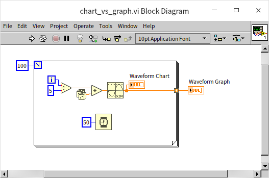

# 图形化显示数据

能够方便的把数据以图形化的方式展现出来，是LabVIEW的一大特色。LabVIEW为此提供了丰富的控件和函数，可以大大简化图形化显示数据的复杂度。

LabVIEW 图形控件选板上列出了几十种控件，本别用于显示不同类型的数据。但实际上，真正用于显示的部分，不需要分成那么多种控件，比如，一个图片控件既可以显示显示用直角坐标系表示数据，也可以显示用极坐标系表示的数据。所以，读者们可能已经发现了，这个选板上的很多控件被拖到前面板上时，它还会在VI的程序框图上添加一些代码。这些代码是真正用来处理不同类型的数据的，它们把不同类型的数据转换为图形控件可以显示的方式，再使用底层图形控件把数据绘制出来。

这个选板上的大多数控件用来显示2维图形数据，另一部分控件可以用来显示3维图形数据。最最常用的是波形图表和波形图控件。

## 波形图表和波形图

在图形控件选板上的波形图（Waveform）和强度图（Intensity），都有对应的图表（Chart）和图（Graph）。图表和图的功能非常类似，最主要的区别在于当图表自带一块缓存，历史数据会被保存在缓存中。当图表接收到新的数据时，它不会把原来显示的图形清除，而是在原图形基础上再把新数据添加上。图没有缓存，每次接受到新的数据，就会把旧图清除，只显示新的数据。

在实际应用中，图表适合显示低速变化的数据，比如某一程序每秒钟读取显示一次锅炉的温度，就可以使用波形图表。这样不但能够显示当前数据，还可以为用户提供历史数据，直接观察到温度的变化趋势。如果程序展示的是瞬时的高速采集数据，就无需逐点显示数据了。比如，程序在0.01秒内采集了1000个被测物体的震动信号数据，即便在0.01秒内逐个画出1000个点，人眼也无法看到绘图的过程。这种情况更适合在采集完全部1000个数据后，使用波形图控件直接显示全部数据。

在VI前面板上新加一个波形图表控件，会发现它在程序框图上的数据类型是DBL的实数数值类型；在VI前面板上新加一个波形图控件，会发现它在程序框图上的数据类型是实数数组类型。波形图表控件的数据端通常会放在一个循环内，每次循环迭代为波形图表提供一个数据；波形图控件则每次接受一组数据，然后全部显示出来。比如下图中的程序，绘制了一条带有噪声的正弦波信号。波形信号被本别传递给了一个波形图表和一个波形图控件，但传递方式有所不同：

运行VI，会看到波形图表和波形图控件最终显示的数据曲线完全相同。区别在于程序的运行过程中，

