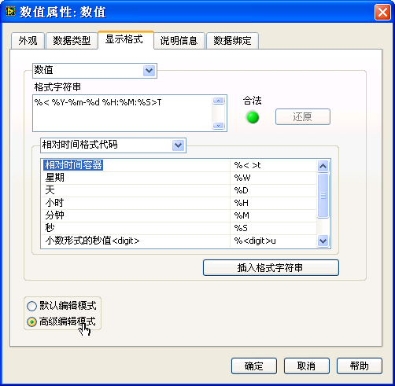
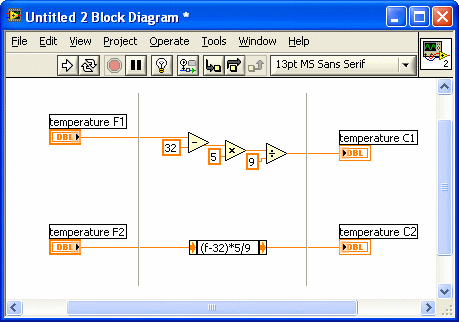
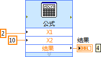
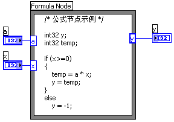

# 数值

## 数值控件及其显示格式

在LabVIEW的控件栏中有一栏是数值控件（图 2.1）。

图 .1数值控件

这一栏中的控件虽然在前面板上的外观各不相同，但是它们所表示的数据类型是相同的，都属于数值类型。（选板右上方两个控件的数据类型是"时间"，后文还会有专门针对它们的讨论。）还有一些控件，尽管位于其它选板，但它们的数据类型也是数值型的，比如下拉列表控件、列表框控件等。

反过来，当你确定了数据的类型是数值，需要选择一种控件来表示它的时候，可以根据数据的应用环境和表达的具体意义来选定一种控件。例如，在工厂生产流程中，表示某个油罐内的储存油量时，可以选择液罐控件；模拟汽车仪表盘的时候应该选仪表控件；等等。

有时，为了程序显示的需要，还要进一步设置数值型控件的表示法、数值范围和显示格式等属性。表示法、数值范围不影响数据的显示，主要用于对数据的范围加以限制，避免程序运行时出现数值越界错误；显示格式则对程序运行无影响，但可以方便用户观察数据。

我们以最普通的数值显示控件为例，解释一下如何配置它的显示格式。打开该控件右键菜单的属性栏，在弹出的数值属性对话框的显示格式页，可以选择所需的类型和进制格式：十进制，或十六进制等。假如我们要用数值显示控件来显示时间，使用单一的数值来显示时间，显然不符合我们识别时间的习惯。我们需要让它按照年月日的格式把时间值显示出来。

打开这个控件的属性对话框，在显示格式页面中，选择"高级编辑模式"，就可以为控件设置显示方式了（图
2.2）。例如，在"格式字符串"一栏中输入"%\<%Y-%m-%d
%H:%M:%S>T"，可以让控件按照"年-月-日
时:分:秒"的格式把一个实数数值显示出来（图
2.3）。而这个实数用来表示时间时，其含义是指1904-01-01
08:00:00这一时刻之后的多少秒。

图 .2配置数值控件的显示格式

图 .3按时间格式显示的数值控件

## 常量

鼠标右键点击某一个数值型数据常量，可以看到其快捷菜单中"匹配至输入数据"一项是默认选中的。也就是说，常量将会根据输入值自动选择表示法。例如，在常量中输入一个正数，假设为"34"，常量的类型会自动变为I32整型（蓝色）；假如输入为"34.3"，常量的类型会自动变为DBL实数型（桔黄色）。如果要输入实数型34，则应该输入"4.0"。

数值型控件并无这一选项。也就是说，对数值型控件而言，必须视需要人为选择控件的表示法。

## 表示法

一个数值型数据还可以有多种不同的表示法，用来表示不同范围和精度的数据。我们可以认为数值类型属于一种数据类型，而I32，U8等只是不同的表示法；也可以把数值类型的不同表示法视作不同数据类型。在文本编程语言中，一般都是把I32，U8等当作不同的数据类型处理的。

在VI的前面板上放置一个数值型控件，或在程序框图上放置一个数值常量，在它们的右键菜单中可以查看或更改其表示法（图
2.4）。

{width="1.6875in" height="1.8125in"}

图 .4数值类型的不同表示法

在LabVIEW帮助的索引中搜索"数值"，打开数值分类下的数据，可以查看到每种表示法的详细解释。从表示法的图标中可以很清楚地看出，每种表示法的区别在于数据长度不同。计算机使用的是二进制，每一位可以表示0或1两个值，8位为1字节。每种表示法的长度如表
2.1所示。

| EXT | 扩展精度实数，16字节长   | DBL | 双精度实数，8字节长   |
|-----|--------------------------|-----|-----------------------|
| SGL | 双精度实数，4字节长      | FXP | 定点数，最大8字节长   |
| I64 | 带符号64位整数           | I32 | 带符号32位整数        |
| I16 | 带符号16位整数           | I8  | 带符号8位整数         |
| U64 | 无符号64位整数           | U32 | 无符号32位整数        |
| U16 | 无符号16位整数           | U8  | 无符号8位整数         |
| CXT | 扩展精度复数，2×16字节长 | CDB | 双精度复数，2×8字节长 |
| CSG | 单精度复数，2×4字节长    |     |                       |

表 .1各表示法长度

一般来说，长度越长，可以表示的数值范围就越大、精度也越高，但计算速度越慢，占用存储空间也越大。

选择表示法首先要考虑能够满足程序需求。比如说I16表示法能够支持的数值范围是-32768到32767之间的整数，这个范围甚至不够计算300×300这样的简单算术运算。我们不妨现在就编写一个程序：新建一个VI，在VI上放置两个值为300的I16常量，然后相乘，将乘积用一个I16的数值控件来显示，看看他们的积是多少。这种错误如果隐藏在一个大工程内，查找起来也是颇为费劲的。（参见图
8.18数值溢出错误）

I64可以表示的范围就要大很多，可以达到10^18^数量级。但这样的数量级如果用于计算阶乘，最多也只能算到20的阶乘（即20！）。需要更广泛的数值范围，或者用到小数时，就要使用实数表示法。某些科学计算中还需要用到复数。

其次，要考虑程序的运行效率和存储效率。计算机对于实数的运算速度要大大慢于整数运算。所以，程序中的数据，若能够以整数表示的，如表示人数、物件个数等只可能出现整数的物理量，数值又不会太大时，尽量使用整数，而不要用实数。

复数是由两个分别表示实数部和虚数部的实数组成的，运算速度更慢。

对于单个数据而言，使用U16与使用U32表示法相比，不过相差两字节。这个长度上的差别可以忽略不计，对程序占用的存储空间根本不会有什么影响。为安全起见，不妨尽量使用长度较大的表示法。但如果数据量较大时，选择不同表示法会导致程序内存占用的巨大差异，需要加以慎重选择。比如用于一个拥有大量元素的数组，若数组有1,000个元素时，元素采用U16与U32表示法相比，则有2K字节存储空间的差别；若数组有1,000,000个元素时，差别达到2M字节，已经相当可观。

## 数值运算的常用函数

与数值数据相关的基本运算函数和相关节点位于"编程-\>数值"（图
2.5），"编程-\>比较"等函数选板下。

图 .5数值运算相关节点

这些函数节点的图标非常直观地表示出了它们的功能：加、减、四舍五入、求倒数等。在"数学"函数选板中，还有一些更复杂的有关数学运算的函数和VI。每一个函数的用途都可以在LabVIEW帮助文档上找到，本书就不重复了。我们在这里着重讨论一下，在众多功能类似的运算方法中，如何选择一个最合适的方法。

对于简单的加减乘除运算，使用基本的函数节点就够用了。如果是较为复杂的数值运算，就需要大量函数节点。节点之间的连线可能会有转角甚至相互交叉，显得比较杂乱，不利于程序阅读和维护。此种情况下，我们可以选用其它一些更好的编程方法。

## 表达式节点

对于只有一个输入和一个输出的运算，我们可以使用表达式节点。

图 .6表达式节点的应用

还记得在上一章提到过的把华氏温度转换为摄氏温度的VI吧（参见图
1.34华氏转摄氏VI的前面板和程序框图）。F1到C1的转换是通过基本运算函数完成的。尽管运算并不复杂，但读者恐怕还是无法一下就意识到这个运算与计算公式是完全一致的，还需要一步一步加以判断。这是图形化语言在表达纯数学计算时的弱点。而文字表达方式，因为它与教科书、文字资料中常见的公式书写一致，所以更为直观易懂。在LabVIEW中，表达式节点是使用文字来描述运算的。图
2.6的下半部分显示的就是一个使用表达式节点的程序，用户可以直观地读出该节点所使用的公式。

与使用基本运算节点相比较，表达式节点的另一个优点是节省了框图上的空间。

在表达式节点中只允许有一个字符串代表输入参数，即只能计算单变量函数。例如，图
2.6中用f表示输入参数。LabVIEW在线帮助里列出了表达式节点所支持的运算符、函数和表达式规则。

## 公式Express VI

如果运算有多个输入，可以使用公式Express VI（图
2.8）。我们在后续章节中还会详细讨论Express
VI的特点和使用方法，这里仅简单介绍一下公式Express
VI。该VI在函数选板"数学-\>脚本与公式"下。图 2.7是这个Express
VI的配置面板，它看起来就像是一台高档计算器，用户基本不需要学习就可以使用了。

图 .7配置公式Express VI

图 .8公式Express VI在程序框图上的外观

公式Express
VI的缺点是：它的表达式是隐藏起来的，在程序框图上看不到具体的公式。用户需要查看，还得先调出配置面板才行。

## 公式节点

对于多输入多输出或更加复杂的计算，可以使用公式节点（图
2.9）。用户可以把它看作是更为复杂的支持多输入输出的表达式节点。公式节点中的表达式语法与C语言类似，但是功能比C语言要简单得多。对于熟悉C语言的用户，使用公式节点不会遇到任何困难。

在实现算法时，人们往往更习惯于文本表达方式。我们在书本中学习到的公式，对计算过程的描述，都是用文本方式来表达的。并且，在具有较多选择结构的程序中，文本表达方式可以有顺序地显示所有分支中的内容；而LabVIEW在遇到选择结构时，每次只能显示一个分支的内容，其它的分支要点击鼠标后才能逐页读到，可读性差。因此，在较为复杂的数学运算程序中，使用公式节点可以让程序的可读性和可维护性得到提高。

图 .9公式节点

图
2.10是某个棋类游戏程序中的一个子VI，用于计算可以走子的位置。它实际上就是针对一个二维整数数组的一些简单数值操作。程序嵌套了多个循环与选择结构，使得它相当难以读懂。

图 .10计算可以走子的位置

图
2.11是一个完成相同功能但使用了公式节点的子VI的程序框图。它读起来显然更加顺畅，公式节点中的代码也更容易理解。

图 .11用公式节点计算可以走子的位置

公式节点的缺点是：对于毫无C语言编程经验的用户，还要花费一些时间先学习公式节点的语法，给他们增加了一点难度。

公式节点中的代码无法设置断点和进行调试。为了保证公式节点中代码的正确性，可以先在一个C语言编译器中对其进行编译调试，在保证其正确性后再在放入LabVIEW公式节点中使用。

## MathScript脚本节点

MathScript节点也是一种以文本方式编写的数据处理程序节点，它采用了仿真与数学运算等领域较为常见的M-Script语法。MathScript提供了更加丰富的计算功能，适用于需要大量复杂科学运算的场合，但运行效率上逊色于公式节点。MathScript的用法已经超出了本书介绍范围，有兴趣的读者可以参考相关书籍和资料。

## 数值的单位

数值型控件和常量是可以带单位的。在数值型控件的快捷菜单上选择"显示项-\>单位标签"，就可输入数值的单位了。单位是用英文字母缩写来表示的，如果你对某个单位的正确拼写没有把握，可以先任意输入一个字符，然后用鼠标右键点击单位标签，选择"创建单位字符串"。这时，LabVIEW会弹出一个对话框，显示出LabVIEW支持的所有单位。

数据从一个单位转换为其它单位时，数值是会自动换算。例如要计算2年有多少天，可以用图
2.12中的程序：

图 .12年与天的换算

给某种数据类型的控件赋予另一种数据类型的数据，如把一个I32型的数据赋值给字符串型的控件，肯定是一种错误行为。LabVIEW与大多数编程语言一样，也具备在编译时报告此类错误的功能。除此以外，LabVIEW还具备对数值型数据进行单位一致性检查的功能。这种检查更严格：不仅实数与字符串之间不可以相互赋值；同样是实数型的两个数据，如一个表示时间，另一个表示长度，它们之间也不能相互赋值。

故此，我们在编写LabVIEW程序的时候，应当尽量使用带单位的数值控件。如图
2.13所示，当你试图把表示时间的数据和表示长度的数据相加时，LabVIEW会禁止你连线。这有助于防止编程时出现的不一致性错误。

图 .13不同类型的数据不能进行计算

但是，这种严格的单位一致性的检查也可能会带来麻烦。例如，我们编写了一个子VI，用于计算两个时间数据之和。下次，当我们需要一个计算长度数据之和的子VI时，却不能够直接使用这个已有的、计算时间数据的子VI，因为它们的单位是不同的。为了解决这个问题，LabVIEW提供了单位通配符。

在编写能够适用于不同单位的子VI时，可以使用单位通配符。单位通配符用\$n表示（图
2.14），其中n是1到9之间的任意一个数字。以我们刚才提到的加法为例：可以在子VI中使用通配符\$1；如果还需要一个执行其他运算的子VI，其单位可以用\$2表示；依此类推。

图 .14使用单位通配符

使用"单位转换"节点（在"编程-\>数值-\>转换函数"选板下）可以把一个纯数字量转换为带有单位的数字量，或者反向转换。使用同一选板下的"基本单位转换"节点，可以更灵活地把某一数值从一个单位直接转换成另一单位。需要注意的是，单位转换节点的外观和表达式节点的外观一模一样，甚至快捷菜单也极为相似（这可能是LabVIEW的一个缺陷），但它们的功能完全不同。千万不要试图在表达式节点中使用"创建单位字符串"菜单，它既不会执行单位的转换，也不会报错。