# 显示 

## 波形图表和波形图控件

测试程序常常需要把采集到的数据显示出来，最常用的两个显示数据的控件就是波形图表和波形图控件。这两个控件的功能和使用方法都非常类似。它们的主要区别在于波形图表能够保存历史数据，每次传递给它一个新数据，它就把新数据追加在原有的数据上。而波形图不保存历史数据。所以，如果程序中需要一边采集数据一边显示，就使用波形图表控件。如若需要一次性显示一个完整波形的，就使用波形图控件。

由于这两个控件的用法相似，很多功能都通用。在LabVIEW的帮助文件中，有对于这两个控件的详细说明。本书只介绍一些波形图控件使用中的注意事项和应用技巧。

## 波形数据类型

波形图控件可以接收多种类型的数据，最常用的类型是数值数组和波形。一个一维数值数组可以表示一条曲线，数组中每个数据的索引表示曲线X轴的值，而数据的值则表示曲线Y轴上的值。一个二维数组则可以用来表示多条曲线。

波形是一种特殊的数据类型，可以把它想象成一种特殊的簇类型数据。它包含四个元素：t0（采样起始时间）、dt（采样间隔时间）、Y（数据，一维数组表示的每个点对应Y轴上的值）、attributes（波形的一些属性）。由于波形包含的信息多于单纯的数组，所以程序中应当尽量以波形数据类型来表示采集到的数据。

图
7.18中的程序生成了一个波形数据。这个波形中的Y数据不是来自硬件采集设备，而是通过函数模拟产生的一组数值。它以系统当前的时间作为波形的起始时间，采样间隔是0.1秒。

图 .18生成波形数据

既然波形中包含了时间信息，那么在表示它的时候，X轴直接显示时间信息会更加直观。若需要波形图控件的横坐标显示时间，只要调整它的显示格式即可。鼠标右键点击波形图控件的横坐标，选择"格式化"即可对其显示格式进行配置。它的设置方式与普通数值控件显示格式的设置方式相同（参考第2.1.1节）。直接选择"绝对时间"格式即可在X坐标标尺上显示时间，也可以使用高级设置选择自定义的显示格式（图
7.19）。

图 .19以时:分:秒格式显示的波形图横坐标

使用"设置波形属性"和"获取波形属性"可以读写波形数据中的属性。波形中可以保存一些任意名称和任意类型数据的属性。采集数据时的某些信息，如通道名称、单位、放大倍数等，这些信息在后续的程序中也许还要用到，就可以把它们当作波形数据的属性保存下来，并传给后续程序。后续程序在需要用到这些信息时，可以从波形数据中把它们读出来。这两个函数分别有一个名为"名称"的输入或输出接线端。在程序中，某些名称的属性具有特殊用途。比如，"NI_ChannelName"表示通道名称。设置了这个属性，波形图中的通道名称会自动更新（图
7.20、图
7.21）。在这两个函数的帮助文件中，可以查看到这些特殊含义的名称属性的详细信息。

图 .20设置属性

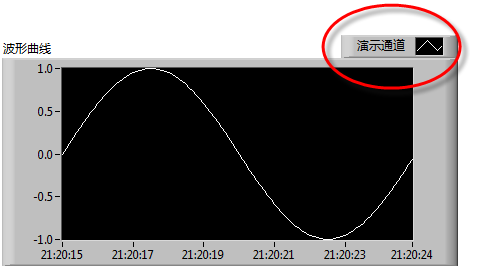

图 .21设置了NI_ChannelName的值，波形图控件中的通道名会自动更新

## 多曲线显示

测试程序常常需要在一个波形图控件上同时显示多条曲线。默认情况下，同一个波形图上所有的曲线都使用相同的坐标来表示。但是每个波形的幅值和位移可能都不相同，如果差距太大，显示在同一坐标系下未必合适。比如，图
7.22中的两条曲线，由于它们的幅值差距较大，在同一个坐标系中，幅值较小的那一条曲线的细节部分就看不清楚。更适宜的方式是为它们设置不同的坐标系，以便把两条曲线的整体和细节都展现得清清楚楚。

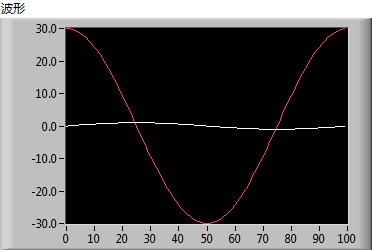

图 .22两条幅值差距较大的曲线

在波形图坐标轴的标尺上点击鼠标右键，选择"复制标尺"，可以为波形图添加一条额外的标尺。每个标尺的刻度可以是不同的，在波形图的属性对话框中或图例的右键菜单中可以选择每个曲线采用哪一个标尺。采用不同的标尺，可以使波形图中每条曲线的显示都达到最佳效果（图
7.23）。

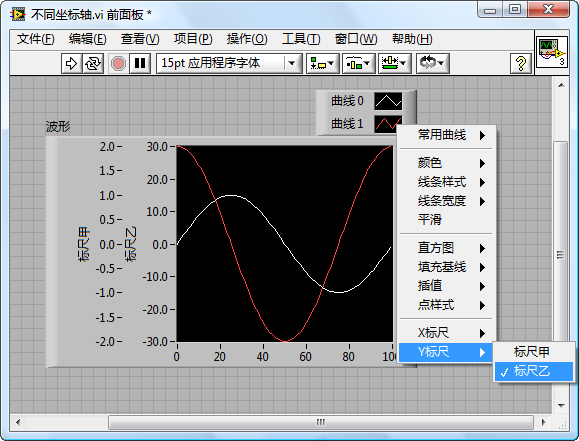

图 .23使用不同标尺显示的多条曲线

## 中断的曲线

有时候需要绘制中间断开的曲线。比如某个信号，在0～1秒有信号，在1～2秒无信号，在2～3秒间又恢复信号。希望在1～2秒间不要把它的曲线显示出来。

简单地把在1～2秒间的波形数据的值设置为0是不能满足这个要求的。如果简单地设置为0，波形图会在Y轴等于0的地方绘制出一条水平直线。应该借助"NaN"数值（）来设置曲线不显示部分的数据。NaN是Not a
Number的缩写，表示它不是一个数值。如果波形中某个点的数据值为NaN，那么在波形图上是不会绘制这一点的。

因此，实现上文提及的功能，只要在程序中把小于0的部分设置为NaN即可，画出正弦曲线大于0的部分，而隐藏小于0的部分（图
7.24、图 7.25）。

图 .24只显示正弦曲线大于0的部分

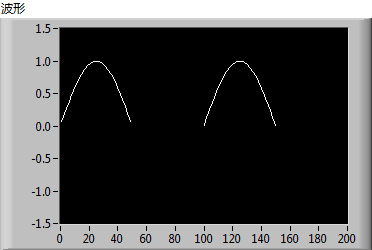

图 .25只有大于0部分的正弦曲线

扩展这一用法，还可以绘制出"一条"可以变换颜色的曲线。比如程序要求用绘制一条正弦曲线，曲线大于0的部分用红色表示，曲线小于0的部分用绿色表示。实现的方法是：在波形图控件上绘制两条分别为红色和绿色的曲线，红色曲线只绘制正弦曲线大于0的部分，绿色曲线只绘制正弦曲线小于0的部分。两条曲线恰好是首尾相连的，看上去就像是同一条曲线有两种颜色。

## 大量数据的显示

有些数据采集设备的采样频率非常高，在很短的时间内就可以采集几M甚至几G的数据。在程序中查看这些数据时，直接把全部数据显示在波形图中肯定不是一个好方法。因为数据太多，把它们全部绘制出来相当耗费时间。

实际上，一个屏幕是无法显示太多数据的。以1024×768的屏幕为例，如果全部用来显示波形图，横向也只有1024个点，也就是说最多只能显示出一条曲线的1024个点。所以一次把所有数据都装入波形图是没有意义的。为了提高程序效率，每次只应该把相当于显示分辨率的数据传给波形图让其绘制出来。

为了保持原有波形的形状不变，用于显示的数据应当是均匀地从原始数据中选取出来的。比如，某一采集到的原始数据有100,000个点，在屏幕上，波形图控件每次可以显示200个点。那就可以在原始数据中，每隔500个点抽取出一个点，组成一组新的数据（图
7.26）。

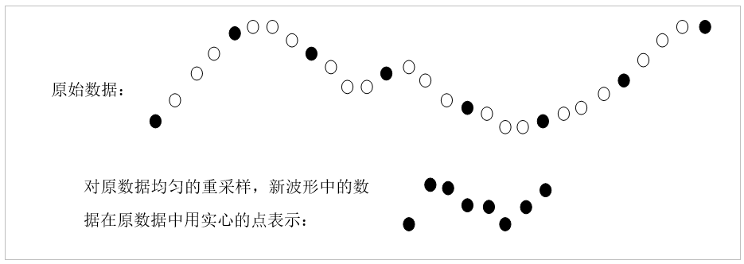

图 .26对原始数据进行重采样以加快显示速度

显示大量数据是导致程序效率低下的一个主要因素。在硬盘上读取大量数据，重采样同样是比较耗时的工作。如果硬盘上保存有一个大数据文件，且经常需要装入内存并显示出来，不妨把这个文件重采样后的缩减版也保存下来。这样每次要显示数据全图时，可以直接装入缩减版的文件，省去了读入大文件和重采样的时间。

数据被重采样缩减后，虽然还保持着原数据的总体外观，但细节部分已经丢失了。若用户需要使用波形图的放大工具试图放大波形图某一部分查看波形的细节处，就不能继续使用这个缩减版的数据了，它无法显示波形的细节。这时，程序必须重新计算数据显示的区域和波形分辨率，重新生成一组重采样缩略数据。

比如需要被显示的数据采样频率为10,000，即每秒钟采集10,000个点。原数据长度是10秒钟，共有100,000个点。波形图每次可以显示200个点。开始显示数据全图时，每隔500个点抽取出一个点，组成一组新的数据。新的一组数据采样率为20，数据时间长度还是10秒钟，由200个点组成。

假如用户在观察了波形全图后，决定选取波形中第3秒和第4秒之间的数据进行观察（图
7.27）。放大后需要显示的数据长度为2秒，对应于原始数据的第3,000～5,000个点。这2000个点也不需要全部在波形图上显示，可以对它们进行重采样，采样频率为100。这样，重采样的数据还是有200个点，表示原数据第2、3秒的内容。

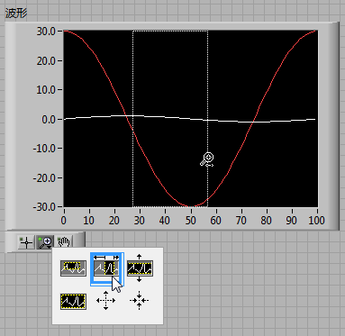

图 .27使用放大工具查看波形细节

## 高速数据的显示

有的测试程序要求一边采集数据一边把采集到的数据显示出来，供用户随时观察。如果硬件采集数据的速度不高，数据变化频率也不够快，可以直接使用波形图表控件把采集到的数据显示出来。

当数据采集速度特别快时，比如采样率达到每秒上万个点。如果还是把所有采集到的数据都传递给波形图表控件，就相当于每秒显示几万个点。图像刷新的速率如此之快，人眼根本无法分辨出每一幅图像。为了降低图像的刷新速度，在显示时可以降低用于显示的数据的采样率。比如降低到每秒10个点左右，再在波形图表控件中显示。这样，波形的移动速度就不会太快，观察者就可以看清楚了。

这个处理方法与处理大量静态数据的显示方法是类似的。它们的缺点也是相同的，就是无法显示波形的细节部分。而实际上，一个程序之所以采用高采样率采集数据就是为了观察采集波形的细节部分。如果被采集的信号是无规律的，那么可以每次以原采样率显示一小段数据，比如0.001秒钟内的信号。图像停留1秒钟，等观察者可以看清楚它，再显示刚刚采集到的0.001秒钟的信号。这种方法虽然可以显示图像的细节，但是观察者实际只能看到0.1%的数据，其它99.9%的数据都没有被显示出来。

大多数时候，被观测的信号都是有规律的周期信号。由于周期信号是重复的，如果能够保证每次在波形图控件上绘制的信号，都从信号不同周期的同一位置开始显示，那么实际上每次显示的图像都和上一副图像几乎是相同的。这样，就可以提高图像刷新速度，而图像仍然会保持稳定的形状不会有无规则的闪动。如果每秒钟刷新20帧图像，显示的数据就可以比上一种方法多20倍。这样一来，既可以显示波形的细节部分，又可以显示更多的数据。这也正是示波器的工作方式（图
7.28）。

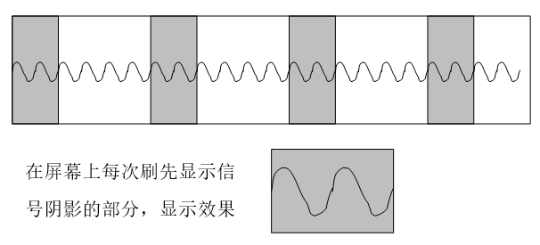

图 .28示波器的工作原理

采用示波器方式显示信号图像，使图像稳定演示的关键点是需要每一帧图像都必须从某个信号周期的同一位置开始显示。可以通过设置触发点来保证每次得到每个周期的同一点。在得到触发点后，再在触发点后截取一段相同长度的波形。

图
7.29是利用声卡来采集声音信号并显示出来的一个简单示波器。它在工作时，首先从声卡读取声音信号，然后根据设定的触发电平找到触发点。在触发点后截取一段波形显示出来。

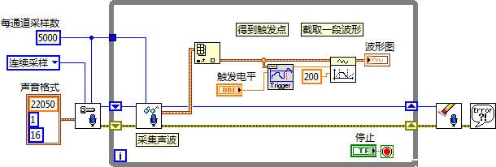

图 .29声卡示波器的程序框图

在测试此VI时，同时使用扬声器产生了一个方波，再利用声卡示波器把声音信号显示出来。图
7.30是声卡示波器的显示效果。在这个波形图中，原始的方波信号也被合成进去了。图中不规则的周期信号是声卡示波器麦克风采集进来的声音信号。这里由于音响系统效果较差，所以信号从扬声器发出，再经麦克风采集回来后，已经完全变形了。但还是可以看出，这个信号是受方波信号激励产生的。调整方波的频率幅值等，采集到的信号也会相应改变。

图 .30声卡示波器的显示效果

## 强度图

常用的波形图可以表达两维信息量。比如常常用横轴表示时间或频率，而用纵轴表示幅值或能量。但实际上，真实信号的能量在不同频率的分布常常是随着时间变化而改变的。如果要把这一变化显示出来，就需要借助有三维信息的图形，分别显示时间、频率、功率。如果要在平面上表现三维信息，则除了横纵轴之外，还可以借助颜色来表示第三维的信息。

强度图提供了使用颜色表示数据大小的功能。某些音频播放软件提供了时频联合分析的功能，即在一张图上以颜色表示声音能量在不同时段和频率上的分布。使用LabVIEW编程可以实现同样的功能。图
7.31是实现这一功能的一段程序。它的实现方法是比较简单的，把声音分成小的片段，比如每秒钟一段，然后分析这一段时间内，声音功率在不同频率上的分布，最后把每一秒钟的分析结果合并在一起，就得到这一数据随时间变化的图谱了。

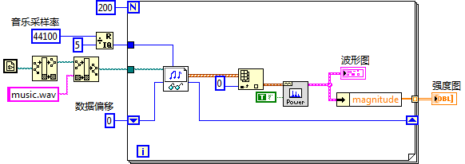

图 .31对声音文件的功率分布进行分析

在选取时间片长度的时候需要注意：如果时间片选取的太短，时频联合分析结果在频域上的分辨率就会比较低；而如果时间片太长，时频联合分析结果在时域上的分辨率会降低。这两个分辨率是矛盾的，此消彼长。对于音乐和语音来说，一般每秒钟最多包含四五个音节，所以选取每200毫秒为一个时间片是比较合适的。

图
7.32是一首钢琴曲的时频能量谱图。从这张图上可以清楚的看出钢琴曲不同音符的跳跃变化。如果需要编写一个程序，把一段音乐转成曲谱，或把录制的电话拨号音还原为电话号码，那么第一步就可以采取上述方式进行时频联合分析。然后得到谱图中高亮部分信号的频率，再将频率转换成相应的音符或电话拨号即可。

图 .32声音能量在不同时段和频率上的分布

为了加快演示速度，图
7.31中的程序直接从声音文件中读出声音的数据。如果把程序改为从声卡或其它数据采集设备中读入数据，就可以对采集到的信号进行实时分析了。

如果安装了"Advanced Signal Processing
Toolkit"工具包，信号处理会变得更加容易。这个工具包包含了针对时序信号分析、时频联合分析以及小波分析所需的各种函数和工具。

例如上文提到的时频分析运算过程，使用"Advanced Signal Processing
Toolkit"工具中的一个"STFT Spectrogram"Express VI就可以完成（图 7.33、图
7.34）。工具包中还提供了其它LabVIEW中没有的时频联合分析方法，如Gabor
Spectrogram、Adapt
Spectrogram等。此外，使用此工具还可以对得到的时频联合谱图做进一步处理，如把谱图上某一区域的信号分离出来。

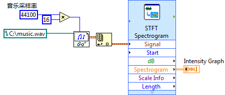

图 .33使用STFT Spectrogram Express VI计算信号的时频联合谱图

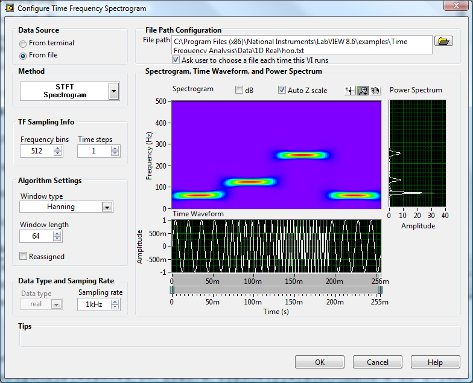

图 .34 STFT Spectrogram Express VI的配置对话框

## 用鼠标在波形图控件上选取一条曲线

有时，用户需要使用鼠标对波形图控件上的曲线进行一些复杂的操作。那么，程序首先就要知道用户鼠标点击的是哪条曲线。实现这一功能，可以利用波形图控件的方法"根据位置获取曲线"，这个方法的输入参数是一个坐标位置，若输入坐标点的附近有曲线经过，就返回这条曲线的索引，否则返回-1。

下面使用一个示例程序来介绍如何利用这一方法获取鼠标点击的曲线。程序的功能为：当鼠标点击波形图控件的某一条曲线时，该曲线变粗。

\
图7.35 获取鼠标点击的曲线的程序框图

图7.35是实现了这一功能的程序的框图。程序启动后，首先画出两条随机数据的曲线。当用户在波形图上点击时，就调用"根据位置获取曲线（GetPlotAtPos）"方法查看是否点击在了某条曲线上。如果是，则使用曲线的属性节点"曲线.线条宽度（Plot.LineWidth）"把曲线宽度设置为2，曲线变宽；否则，曲线维持原宽度仍为1。

程序运行效果如图7.36所示（Plot0曲线被加粗）\
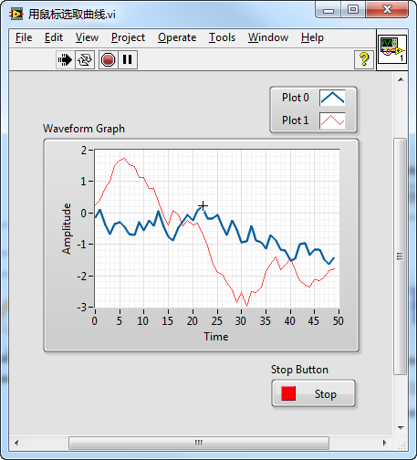\
图7.36 Plot0曲线被选中后加粗
