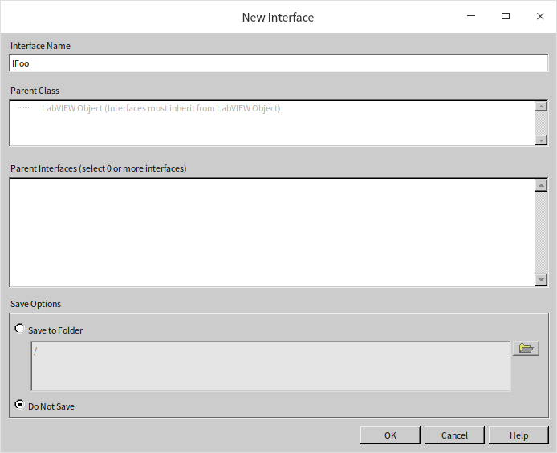

# 接口

## 接口与类的本质区别

先总结一下类与接口最核心的区别：
* 类的继承是为借用父类已经具有的功能；接口的实现是为了保证类可以提供某些功能。假如，我们为一个型号为LV12345的仪器写了一个类，LV12345类若是继承了**示波器类**，则表示LV12345是一类特殊的示波器，并且它需要借用示波器类已经实现好了的各种功能；如果LV12345类实现了**示波器接口**，那么并不表明LV12345属于任何一类仪器，只表示它将会提供所有示波器所具有的功能。
* 一个类只能继承一个父类；一个类可以实现多个接口。如果LV12345类继承了示波器类，就不能再去继承频谱仪类中实现的方法。LV12345类可以同时实现示波器接口和频谱仪接口，表示它既可以提供示波器的功能，也可以提供频谱仪的功能。

由上可见，我们在应用程序中，需要调用一个功能模块的时候（比如需要调用示波器功能，把输入信号的波形记录下来），那么应该总是使用接口作为输入/输出控件的类型，而不是使用类作为输入/输出控件类型。比如，在应用程序中使用了示波器类做输入输出类型，那么这个应用程序就只能使用示波器，那些新型，不属于示波器却具有示波器功能的仪器都不能被使用。但很明显，应用程序需要的并不是确定的一台示波器，而是任何具有示波器功能的仪器。

## 创建接口

创建新的接口与创建新的类相似：在项目浏览器上，点击鼠标右键，选择"新建-\>接口"，就可以创建一个新的接口。不同的是LabVIEW中所有的类都有一个共同祖先类：“LabVIEW对象”，但是接口不一定有祖先接口。

接口的文件后缀名也是lvclass，与类文件的后缀名相同。但是在项目中我们经常会遇到需要采用同样名称的类与接口，比如桌子类和桌子接口，这就需要两者有不同的命名。中文可以就以“XX类”，“XX接口”来命名。英文中通常以接口英文Interface的首字母I作为接口名字的前缀，比如用ITable表示桌子接口。LabVIEW并没有对类和接口的名字有特殊要求，只要起名符合公司或组织的规范即可。

接口跟类一样，可以有继承关系，比如我们先创建一个叫做IParent的接口，再创建一个叫做IChildFoo的接口，让它继承IParent：

我们接下来创建一些类，并选择他们的接口。父类只能单选，但接口是可以多选的。

### 接口中没有数据，

### 接口中必须动态VI？

### 接口方法的默认实现？

### 重新设计

再回头考虑我们在上一节，为家具店设计的程序中存在的一些缺陷，比如，不应该让用户生成一个几不属于桌子也不属于椅子的家具；应该允许处理所有处理椅子的程序接受合体桌椅。这些缺陷可以通过引入接口来解决。

我们引入接口并做如下设计：

* 首先我们需要三个接口：家具接口，桌子接口和椅子接口。桌子接口和椅子接口都继承自家具接口。
* 接口中是没有任何数据的，但可以放置用户自定义数据类型的控件。
* 家具接口定义了两个方法：返回售价，组装。这些是桌子接口和椅子接口都共同拥有的方法。
* 桌子接口定义了四个方法：初始化（设置产品编号，成本价，和桌布型号），返回售价，组装，铺桌布。其中，返回售价和组装方法是从家具接口继承来的。
* 椅子接口定义了四个方法：初始化（设置产品编号，成本价，和靠枕型号），返回售价，组装，放置靠枕。其中，返回售价和组装方法是从家具接口继承来的。

程序中会用到桌子的实例，和椅子的实例，因此桌子类和椅子类依然是必须的：

* 桌子类：实现桌子接口定义的所有方法。
* 椅子类：实现椅子接口定义的所有方法。
* 合体桌椅类：实现桌子接口和椅子接口定义的所有方法。

### 创建