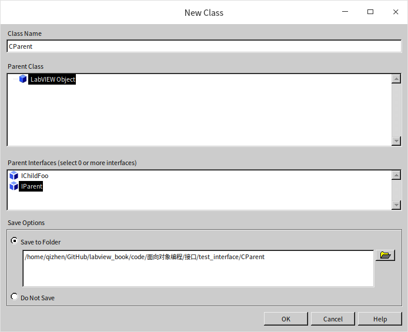
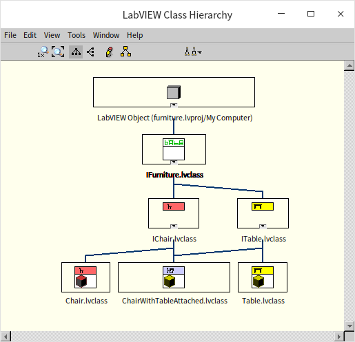
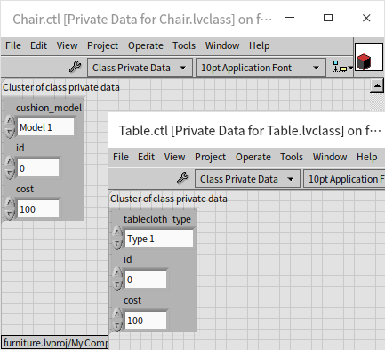
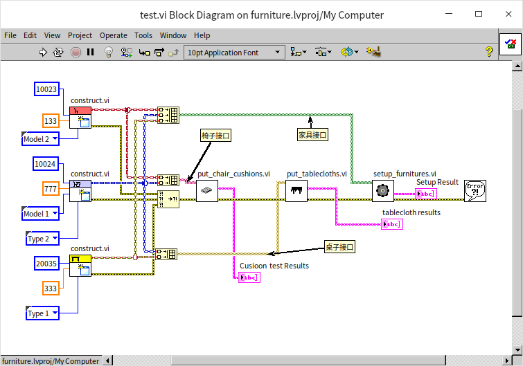
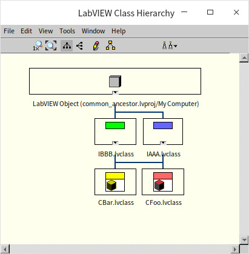
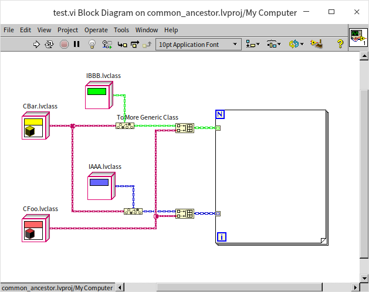
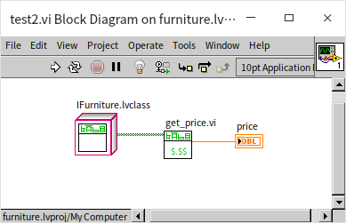

# 接口

## 接口与类的本质区别

我们在[类的优缺点](oop_class_pro_con)一节中，简要介绍了接口的概念，在具体介绍LabVIEW中的接口之前，我们先回顾一下类与接口最核心的区别：
* 类的继承是为了借用父类已经具有的功能；接口的实现是为了保证类可以提供某些功能。假如，我们为一个型号为LV12345的仪器写了一个类，LV12345类若是继承了**示波器类**，则表示LV12345是一类特殊的示波器，并且它需要借用示波器类已经实现好了的各种功能；如果LV12345类实现了**示波器接口**，那么并不表明LV12345属于任何一类仪器，只表示它将会提供所有示波器所具有的功能。
* 一个类只能继承一个父类；一个类可以实现多个接口。如果LV12345类继承了示波器类，就不能再去继承频谱仪类中实现的方法。LV12345类可以同时实现示波器接口和频谱仪接口，表示它既可以提供示波器的功能，也可以提供频谱仪的功能。

由上可见，我们在应用程序中，需要调用一个功能模块的时候（比如需要调用示波器功能，把输入信号的波形记录下来），那么应该总是使用接口作为输入/输出控件的类型，而不是使用类作为输入/输出控件类型。比如，在应用程序中使用了示波器类做输入输出类型，那么这个应用程序就只能使用示波器，那些新型，不属于示波器却具有示波器功能的仪器都不能被使用。但很明显，应用程序需要的并不是确定的一台示波器，而是任何具有示波器功能的仪器。

在很多编程语言中，接口除了可以定义一个类可以被外部访问到的属性和方法之外，还能够确保定义的抽象性，以及减少重复代码。

抽象是指，接口本身不能被实例化，接口是没有对象的。这样一来，类和接口的功能被彻底区分开来。比如在Java语言中，通常都会使用接口作为函数参数类型，而被传递的参数本身，则是某个具体的类的对象。继续沿用上面的例子，应用程序需要使用示波器，那么他应当通过用示波器接口去调用某一台仪器，应用程序并不关心仪器的型号，只要功能满足要求就行；而任何一台仪器都总是属于某个具体类型的仪器的实例，程序中是不应该出现一台不属于任何具体类型的仪器。这样做可以避免一些程序员无意间写错的代码。

为了减少重复代码，有些语言可以在接口中为方法完写一些默认的代码，这些默代码可以被类继承后直接调用，从而不必再每个继承了同一接口的类中重复添加相似的代码。

在LabVIEW中，接口与类非常相似，主要区别只有两点：1.接口中没有数据，2.接口可以被多继承。LabVIEW的接口提供了接口最主要的功能：定义一个类可以被外部访问到的方法。但是对于另外两点，确保定义的抽象性和减少重复代码的支持依然非常有限。所以我们在程序中使用接口时，可能还需要额外做一些设计以强化接口另外两方面的功能。

## 创建接口

创建新的接口与创建新的类相似：在项目浏览器上，点击鼠标右键，选择"新建->接口"，就可以创建一个新的接口。“LabVIEW对象”是所有接口的祖先。接口不能继承任何的类，但是可以继承其它接口。对于一个项目中新创建的第一个接口，它并没有任何其它接口可以继承：

接口的文件后缀名也是lvclass，与类文件的后缀名相同。在项目中我们经常会遇到需要采用同样名字的类与对应的接口，比如桌子类和桌子接口，这就无法只凭文件后缀名来区分二者了。使用中文，可以用“XX类”，“XX接口”来命名。英文中通常以接口英文Interface的首字母I作为接口名的前缀，比如用ITable表示桌子接口。LabVIEW对类和接口的名字没有什么特殊要求，只要起名符合公司或组织的规范即可。

接口跟类一样，可以有继承关系，比如我们先创建一个叫做IParent的接口，再创建一个叫做IChildFoo的接口，让它继承IParent：

我们接下来创建一些类，并选择他们的接口。父类只能单选，但继承接口是可以多选（或不选）的。

## 属性

LabVIEW的接口中不能定义任何数据。接口用来定义一个类具有哪些外部可用的数据和方法，但是LabVIEW的类中的数据都是私有的，不能被外部使用，也就自然不能在接口中定义任何数据了。

## 方法

创建接口中的方法，与创建类中的方法相同，在接口的新建这一栏下可以看到如下条目：VI、虚拟文件夹、基于动态分配模板的VI、基于静态分配模板的VI、用于重写的VI和类型定义。因为接口中没有数据，所以比类的新建方法少了属性定义文件夹和用于数据成员访问的VI。这些条目中VI、虚拟文件夹、用于重写的VI和类型定义都与类中相对应的条目十分相似。只有基于动态分配模板的VI、基于静态分配模板的VI需要深入探讨一下。

### 基于静态分配模板的VI

在接口中创建一个基于静态分配模板的VI，意味着这个方法不能被任何子孙接口或类重写。但是它可以被子孙接口和子孙类继承。也就意味着，子孙类的实例是可以直接传递给这个接口中的VI并直接运行的：

这相当于在接口中添加了一些方法的默认实现，可以共子孙类直接使用。但是由于接口中缺少数据的定义，这个基于静态分配模板的VI不能对任何对象中的数据进行操作，只能做一些并不一定要放在接口中的通用的操作。换句话说，理想状况下，一些应该被放在接口中的共用代码，LabVIEW是不允许他们放在接口中的；LabVIEW允许放在接口中的共用代码很可能并不适合放在接口中。这导致接口的方法继承对于提高代码效率的帮助十分有限。

一个类实现的不同接口中可以存在同名的基于静态分配模板的VI。由于这种方法不会被重写，调用关系是非常明确的，不会出现类在多继承时造成的调用关系混乱的问题。

### 基于动态分配模板的VI

在接口中创建的基于动态分配模板的VI，默认是要求必须被实现它的类重写的。如果不重写，LabVIEW会提示如下的出错信息。

一般来说，我们不需要要改动这个设置。这样，这个接口中的VI必须被重写，所以它的代码是永远不会被执行到的，只有重写了它的类中的方法才会真正被执行。因此，接口的动态VI一般只用来定义方法的名字和输入/输出参数类型。一个类实现的不同接口中可以存在同名并且输入输出参数也相同的基于动态分配模板的VI。又因为接口里的基于动态分配模板的VI是必须在类中重写的，所以我们也可以确定，当这个方法被调用的时候，一定是类中的那个方法被调用了。调用关系也是非常明确的，不会出现类的多继承时造成的调用关系混乱的问题。

默认的设置下，接口中基于动态分配模板的VI，不能被子孙类调用。正如我们前面提到的，接口中方法能做的事情非常有限，即便提供了默认实现，也不会对编程提供太大帮助。当然，如果一定想要使用接口中基于动态分配模板的VI默认实现也是可以的，只要把“必须被子孙类重写”的设置去掉就好了。这样，子孙类中就可以继承接口中方法的默认实现了。LabVIEW对接口中方法默认实现的多继承也做了限制，当某一个类实现的不同接口中有同名的动态VI时，子孙类必须重写这个方法。这样将来不管哪一个程序使用到这个类的对象的时候，都可以明确的知道调用的是这个类当中重写了的方法，而不是调用到了任何一个接口中实现的方法。这样就避免了，在多继承中搞不清楚调用关系的问题。

LabVIEW对于过于复杂的情况和程序员有可能搞不清楚的情况，一般都会报错，以避免可能出现的风险。比如以下几种情况：
* 如果一个类实现的不同接口中存在同名的基于动态分配模板的VI，但是它们的输入输出参数类型不同，这个类是无法被正确实现的，始终会报错。因为重写的VI只能满足一个接口的要求，另一个接口始终无法满足。
* 如果一个类实现的不同接口中存在同名的VI，但这个VI在某些接口中是静态的，某些接口中是动态的，这个类也是无法被正确实现的。因为类中如果不重写这个VI，会出现类没有重写接口中动态VI的错误；而重写了，又会出现重写接口中静态VI的错误。

LabVIEW在功能上所做的限制，可能会使得它无法实现一些比较常见的应用：假设有一台型号叫做LV12345的仪器，它同时具有示波器和频谱仪的功能。我们在程序里也定义了示波器接口和频谱仪接口，这两个接口各自定义了一个方法叫做“初始化”。如果两个接口定义的初始化方法如果参数不同，LV12345类自然是无法同时实现两个接口。但即便两个接口中的初始化方法名字，参数类型都相同，只要所需的功能不同，比如示波器的初始化需要把一个仪器开关设置到1；和频谱仪的初始化需要把同一个开关设置到2，那么LV12345类也无法被正确实现。因为LV12345类只能实现一个初始化方法，而且方法中也无法知道它是在被示波器接口调用还是被频谱仪接口调用，这样就它就无法得知该如何设置那个开关了。

为了避免上述的问题，我们在设计接口时，需要考虑尽可能不要在相关的接口中使用同名方法。甚至可以给方法的名字取得长一些，比如示波器接口中的方法叫做“初始化示波器”；频谱仪接口中的方法叫做“初始化频谱仪”等。

### 访问权限

接口中的VI与类中的VI有类似的访问权限设置。但是，我们要考虑到，定义接口的目的，就是为了确定一个模块具有哪些可供外部调用的功能。其它功能最好都不要放在接口里，这也就是说，接口中定义的方法应该都使用共有访问权限。

## 应用示例

再回头考虑一下我们在[LabVIEW的类](oop_class)一节中为家具店设计的程序，它存在的一些明显的缺陷，比如，不应该让用户生成一个既不属于桌子也不属于椅子的家具；应该允许处理处理椅子对象的程序接受合体桌椅对象。这些缺陷可以通过引入接口来解决。

我们引入接口并对设计做如下修改：

* 首先我们需要三个接口：家具接口，桌子接口和椅子接口。桌子接口和椅子接口都继承自家具接口。
* 接口中是没有任何数据的，但可以放置用户自定义数据类型的控件。
* 家具接口定义了两个方法：返回售价，组装。这些是桌子接口和椅子接口都共同拥有的方法。
* 桌子接口定义了三个方法：返回售价，组装，铺桌布。其中，返回售价和组装方法是从家具接口继承来的。
* 椅子接口定义了三个方法：返回售价，组装，放置靠枕。其中，返回售价和组装方法是从家具接口继承来的。

程序中会用到桌子的实例，和椅子的实例，因此桌子类和椅子类依然是必须的：

* 桌子类：实现桌子接口定义的所有方法，和一个初始化方法（设置产品编号，成本价和桌布型号）。
* 椅子类：实现椅子接口定义的所有方法，和一个初始化方法（设置产品编号，成本价和靠枕型号）。

初始化这个方法，并没有一个类类型的输入，无法把它写作一个基于动态分配模板的VI，也就无法在接口中定义它。此外我们增加一个合体桌椅类，用来演示一个类实现多个接口。并且我们会给它添加一些测试。

* 合体桌椅类（ChairWithTableAttached）：实现桌子接口和椅子接口定义的所有方法，和一个初始化方法（设置产品编号，成本价，桌布型号和靠枕型号） 。

### 创建

创建接口和类的过程之前已经介绍过，不再赘述。打开LabVIEW的“查看->LabVIEW类层次结构”可以看到新的程序中的接口和类的继承关系如下：

### 属性

与之前纯使用类来实现的示例相比，在这个演示中，我们使用家具接口替代了家具类。好处是可以防止用户直接生成一个我们不支持的家具对象，但缺点是我们无法将那些被不同的家具共用的数据和方法的代码放在接口里了，因此，数据和方法的实现不得不被分别挪到了具体的类当中去。比如新的示例中，桌子类，椅子类和合体桌椅类都需要各自添加编号、成本价等本可共用的数据。

之前在家具类中实现的可共用的数据访问功能也需要在每个类中分别实现一份。

### 方法

由于接口中定义的方法，默认状态下是要求必须在类中重写的，如果某个类缺少了接口定义方法的重写，LabVIEW汇报错。新添加的类可能会缺少很多VI，这时候可以在选择“新建->用于重写的VI”的时候，一次选中所有缺失的VI，然后点击生成。

方法的实现与前文使用的示例类似，这里不再赘述。

### 应用测试

测试程序与纯使用类来实现的示例非常相似，不同之处在于这一次使用了三个各不相同的类产生的对象做测试：

当把一个椅子对象和一个组合桌椅对象绑定成一个数组时，LabVIEW会把数组的类型变为椅子接口类型的数组，从而两种对象都可以被接受椅子接口的程序处理；当把一个桌子对象和一个组合桌椅对象绑定成一个数组时，LabVIEW会把数组的类型变为桌子接口类型的数组；当把三种不同的对象绑定成一个数组是，LabVIEW会把数组类型变为家具接口类型。

如果两个对象没有任何共同的祖先接口，把他们绑定成一个数组后，LabVIEW依然还是会把数组类型转换成“LabVIEW对象”，这样就可以用来处理任何对象了。

但有一种情况，LabVIEW汇报错。如果几个对象，有多个共同的祖先接口，把这些对象绑定成数组时，LabVIEW会搞不清楚用户需要使用哪个接口，于是报错。比如下图所示的例子：

类CBar和类CFoo各自都继承了接口IAAA和接口IBBB。这时候，把一个CBar的对象和一个CFoo的对象绑定成一个数组，程序会出错，提示有类型冲突：

遇到这种情况，就只能用户手动指定需要使用哪一个接口了：

## LabVIEW的接口为什么不是抽象的

前文提到，在家具店这个演示程序中，是不应该允许出现一个既不是椅子，也不是桌子，也不是合体桌椅的家具对象的。因为程序中，家具店只有这三类家具，如果出现了一个对象，不属程序中定义的类，那么很可能是无意间犯的错误。在这一节的演示中，我们使用了家具接口来替代家具类，然而很遗憾，这仍然不能放置有人直接把家具接口实例化。LabVIEW中的接口不是抽象的，我们直接把一个借口拖到程序框图上，就可以为这个接口生成一个实例，然后使用这个实例调用接口中的方法：

好的接口设计应该可以尽量放置使用者错误的使用接口，所以我们需要对这种情况做一些预防措施。在接口中定义的基于动态分配模板的VI是必须在子孙类中被重写的，所以接口中的VI的代码在正常情况下，永远都不应该被执行到。如果被执行到了，说明这个方法是被一个从接口直接生成的对象调用的。如果这时候程序报错，就可以提醒编程者及时修改这个错误。所以，接口中的方法最好不要空放着，而是应该返回一个错误以避免潜在的问题。下图是一个接口中方法VI的程序框图：

造成LabVIEW中没有抽象类的本质原因是因为LabVIEW中没有纯粹的数据类型控件或常量（这个比较拗口），在程序中必须使用一个数据来表示数据类型。在很多编程与严重，我们可以使用关键字“int”来表示整数数据类型，但是LabVIEW中没有类似的关键字（或者常量、控件、节点等），LabIVEW中必须使用一个具体的数值，比如0或23等来表示整数数据类型。回顾我们在[数据类型转换](data_datatype_cast)一节介绍过的把实数强制转换为整数的例子：

我们需要用一个整数I64数据类型的数值0来表示目标数据类型是I64。在上文的“动指定接口类型”的示例程序中，我们要把一个CBar类对象转换为IAAA接口类型，那么也必须使用一个类型为IAAA的实例来表示IAAA类型。这种数据类型无法与数据分离的设计虽然不是特别合理，但恐怕已经无法被LabVIEW修改了。

## 改善代码重用

这个家具点示例程序还有一个问题，就是重复代码偏多，比如不同类中的同名VI，它们的代码都是非常类似的。但是我们却无法在接口中编写她们的共同代码，因为接口中缺少必要的数据。一个简单的解决办法是为这些共同代码造一些子VI，通过使用子VI来提高代码重用性。

## 总结

在本节最后，根据上文提到的所有实验，总结一下LabVIEW接口的推荐使用方式：
* 接口只用来定义模块（实现这个接口的类）的那些供外部调用的共有方法。
* 接口中只包含基于动态分配模板的VI，并且设置为必须在子孙类中被重写。
* 又接口直接生成的对象只能备用来在类型转换是得到接口数据类型，不能用于调用接口中的方法。接口中的VI，一旦被直接调用，立即返回错误信息。
* 方法名应该尽量包含细节，以避免可能的名字冲突。
* 如果一个接口会被多个类实现（继承），额外创建一些子VI一提高代码的重用度。
