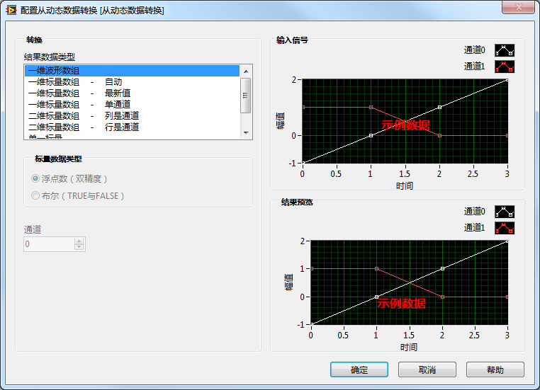
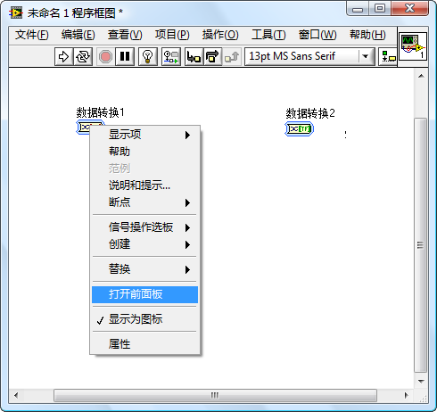

# Express VI

## 什么是 Express VI

Express VI 是指那些带有配置对话框，可以在编辑VI时就设置输入参数值的VI。Express VI是专为简化常见类型的程序而设计的。一些LabVIEW常见的程序模式，比如完成数据采集、波形的频域变换等功能的程序，都可以使用一两个Express VI，做一些简单配置，就可以完成。为了便于程序员寻找，LabVIEW中的常用的Express VI都可以在函数选板"Express"中找到；也有一些功能复杂，不太常用的Express VI被按照功能归类到了其它子函数选板中。

从函数选板上直接就可以看出Express VI与普通VI的区别：Express VI 的图标周围有一圈浅蓝色的边框。如图4.51中的 "时间延迟"和"已用时间"VI。

 \
图4.51：函数选板上的Express VI

Express VI在使用时，也与普通VI有些不同。Express VI通常都配有一个配置对话框（图 4.52），用于设定Express VI运行时所需的一些数据，因而不必再在程序框图上输入数据。这就大大简化了程序框图。Express VI的功能通常都比一般的VI强大。某些常见的简单程序，譬如基本的数据采集显示程序，仅需使用几个Express VI就可以实现。加之使用它编程也比较简单，所以得名"Express VI（中文直译快捷VI）"。

   \
图4.52："时间延迟"Express VI和它的对话框

Express VI的功能强大、使用便捷，但付出的代价是效率较低。在一些功能简单的应用程序中，它所调用的Express VI也许包含了大量应用程序根本用不到的功能。这部分功能既占用内存空间，又会影响程序的运行速度。所以，对于效率要求较高的程序，不适合使用Express VI。

## 子VI在程序框图上的显示方式

普通子VI被放置到程序框图上时，其默认的显示方式是图标。在以图标方式显示时，可以在其右键菜单中选择"显示项->接线端"，将其连线板显示出来。它还有另一种显示方式：可扩展节点。在子VI的右键菜单中放弃选择"显示为图标"便可以更改其显示方式。以可扩展节点方式显示的子VI，可以通过拖拽框图的下边框线把所有的接线端都移至下方列出（图 4.53右侧的子VI）。

图 4.53子VI的三种不同显示方式

Express VI与普通子VI一样，也有这几种显示方式。不过，Express VI的默认显示方式是可扩展节点，而且不论在哪种方式下，它都带有一个蓝色背景的边框。

以可扩展节点方式显示的子VI要占用较大的显示面积，但它也有很多优点：它可以把子VI接线端的名称显示出来，增强了程序的可读性；Express VI的可扩展方式是可伸缩的，暂时用不着的接线端可以被缩起来。被拉伸开来的接线端之间的距离比较宽松，如果VI上的接线端较多，使用可扩展方式显示的子VI更利于区分各数据线和接线端。

比如图 4.54中的"ex\_subFileWrite.vi"子VI，其输入输出参数非常之多，使用可扩展节点方式可以清楚地显示出每个参数的连线情况。如果使用图标方式，则根本无法分清参数是如何连接的（图 4.55）。

图 4.54使用可扩展节点方式显示一个参数众多的子VI

图 4.55使用图标方式显示一个参数众多的子VI

## Express VI工作原理

普通的子VI有前面板和程序框图。子VI前面板上的控件定义了这个子VI所使用的参数；程序框图上的代码实现了这个子VI的功能。在某个VI程序框图上，双击一个普通子VI的图标，可以打开这个子VI的前面板；按住Ctrl键双击子VI的图标则可以同时打开它的前面板与程序框图。

Express VI 的行为与普通子VI有所不同：在程序框图上双击一个Express VI的图标，弹出的是一个配置对话框。一般来说，应用软件中的普通子VI都是由程序员自己开发的，因此，需要打开子VI的前面板与程序框图进行编辑、修改和调试。而Express VI通常是LabVIEW或LabVIEW工具包自带的，并不需要普通程序员去创建或修改一个Express VI，一般也就不需要看到它内部的代码。一个Express VI 通常会集成多种功能，因此程序员在使用它时，可以方便地打开Express VI 的配置对话框，根据各自的需要，选择适合的配置参数。

普通的子VI的程序框图被保存在一个.vi文件中，对于普通子VI来说，不论是哪个应用程序调用它，或在应用程序的哪个地方调用了它，该子VI所执行的代码都是相同的，也就是说都是运行保存在.vi文件中的那个程序框图。对于Express VI来说，却并非如此。程序员可以根据需要修改Express VI配置对话框中的内容，配置一旦被改变，Express VI的执行代码也会发生变化。因此，在不同的地方调用同一个Express VI，它所运行的代码却可能是不同的。这也就决定了Express VI的程序框图不能被保存在单一的一个.vi文件中。实际上，Express VI的程序框图是被保存在调用它的VI的.vi文件中的。比如说，某个VI名为A.vi。若A调用了一个名为B的 Express VI，则B的程序框图也被保存在了A.vi中。不过，用双击B图标的办法是无法直接看到B的程序框图的。

有些Express VI是允许用户查看其程序框图的（有些则不提供这一功能）。在一个 Express VI 的右键菜单中选择"打开前面板"，LabVIEW会把Express VI转换成不可配置的普通子VI，它的代码也就被固定下来了。这样，它就有了可以打开的前面板和程序框图。以"从动态数据转换"Express VI 为例（函数选板"Express --> 信号操作 --> 从动态数据转换"）。在某一VI的程序框图上放置两个"从动态数据转换 "Express VI，分别命名为"数据转换1"和"数据转换2"。

把"数据转换1"Express VI的 "结果数据类型" 配置为"一维波形数组"（如图4.56所示），再把Express VI 转换为普通VI并查看其程序框图（如图4.57所示），可以看到这个Express VI 的程序框图由一个简单的子VI构成（如图4.58所示）。

\
图4.56 "数据转换1"Express VI 的配置对话框

。

 \
图4.57：打开Express VI的前面板，然后打开程序框图

 \
图4.58： "数据转换1" Express VI 的程序框图

把"数据转换2"Express VI的 "结果数据类型" 配置为"二维标量数据"；标量数据类型配置为"布尔"。使用同样方法打开"数据转换2"Express VI 的程序框图。可以看到，它与"数据转换1"的程序框图完全不同，因为它们需要完成的功能是完全不同的。

 \
图4.59："数据转换2" Express VI 的配置对话框

 \
图4.60："数据转换2" Express VI的程序框图

## Express VI 的优缺点

相当一部分使用LabVIEW的用户并非计算机软件或相关专业的人士，他们或许并不擅长编写复杂的程序。为此，LabVIEW想尽办法，降低编程难度，以满足非计算机专业人士的需求。 降低编程难度的手段之一，就是使用简单的参数配置来代替复杂的程序逻辑。比如完成某一功能，如果仅仅是在某一面板上选择几个参数，肯定要比在程序框图上编写代码容易得多。

为了简化编程，LabVIEW把测试领域常常会用到的一些功能集成到了几个功能极为强大的子VI中。子VI的功能越复杂，所需的各类数据就越多。比如，测试程序常常会遇到需要产生一个波形数据的情况，为此，LabVIEW提供了一个产生波形数据的Express VI。

产生一个波形数据需要编程者提供诸如波形的类型、频率、幅值、相位、采样率、采样数等数十个具体的参数。如果用一个普通子VI的方式来提供这些功能，这个子VI就需要有数十个接线端，以至于它的程序框图显得杂乱无章，降低了程序的可读性。更何况编程者也很难在程序还未运行之前就设计好每个数据的具体值。这样就使得编程更为困难复杂。

而实际上，在某些特定的应用场合，并不需要把这十几个参数都作为变量来考虑。对于某个特定的程序而言，它往往只需要产生某种固定的波形，或只需要某些固定的频率、幅值等。也就是说，程序只需要其中一部分功能。在这种情况下，使用功能复杂的大VI，不但给人一种杀鸡用牛刀的感觉，而且由于参数过多，使用起来并不简便。

Express VI正是为了解决这一矛盾而出现的。它为使用者提供了一个配置对话框，VI所需的数据可以在配置界面上直接选择。第一次把Express VI放置在程序框图上或者双击程序框图上的Express VI，就会显示出它的配置界面。配置界面上有提示信息，可以帮助编程者选择正确的配置数据。有的配置界面还带有反馈信息。比如，仿真信号Express VI的配置界面上就包含了"结果预览"。编程者无需运行程序，在配置参数的同时，就可以在此界面观察到所选参数的效果了。

Express VI大大简化了编程的难度，但也带有它固有的缺陷。到目前为止，Express VI的数量有限，不可能覆盖所有测试程序所需的功能。若程序要求比较特殊，或者使用的是不太常见的仪器、数据采集卡等设备，仍然需要用普通的子VI来编写程序。

Express VI的另一缺点是其效率较一般VI低。一般而言，Express VI功能复杂，而应用程序通常只会用到其中的一部分，它的其它众多功能在这个应用程序中是毫无用处的。而由于Express VI提供了众多附加功能，通常它的代码比一般VI更臃肿，运行速度也慢一些。

## 开发自己的 Express VI

除了 LabVIEW 自带的 Express VI，如果编程者愿意，也可以创建自己的 Express VI。在LabVIEW8.6以后的版本中，打开"工具->高级->创建或编辑Express VI"菜单项，将弹出一个"创建或编辑Express VI"的对话框，并可按部就班制作出一个Express VI。
