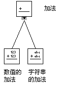
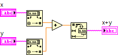
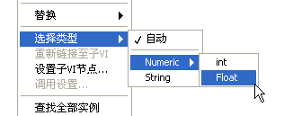

# 多态 VI

## 使用变体作为子 VI 的参数类型

设计程序时可能会遇到这样的情况，需要一个具有某种算法功能的子 VI，该算法能够适用于多种不同的数据类型。比如，需要定义一个加法操作，它支持两种数据类型：数值数据类型和字符串数据类型。如果输入两个数值，输出就是它们的和；如果输入两个字符串，则是把字符串表示的数值相加然后再以字符串的形式输出。采用一般的方法编写这个子 VI 时，VI 的输入参数或是选用数值型控件，或是选用字符串型控件。一旦这个控件类型选定，子 VI 能够接受的数据类型也就确定了。这个子 VI 或者只能处理数值数据类型的数据，或者只能处理字符串数据类型的数据，二者不能兼顾。

解决这个问题的方法之一，可以使用在第 2.3.6 节曾经介绍过的 "变体" 数据类型作为子 VI 的参数数据类型。任何数据类型的数据都可以转换成为变体，这样，就可以把任意类型的数据传入子 VI 了。在子 VI 中再把变体转换成相应的数据类型进行运算。使用此方法编写的子 VI 如图
4.43 所示。图 4.44 则是调用了 "变体" 子 VI 的上层 VI 程序。

图 .43 使用变体作为参数类型的子 VI

图 .44 使用图 4.43 中的变体子 VI 的上层程序

使用变体作为子 VI 的参数类型虽然可以让子 VI 处理多种数据类型，但是它也存在一些缺点。

首先，它的类型安全性比较差。比如，程序要求的算法只能处理两个数值或者两个字符串输入数据。但实际上，把任何类型的数据与这个子 VI 相连，或者给两个参数 x，y 输入不同类型的数据，VI 都不会报错。只有在运行到这一子 VI，进行数据类型转换时，程序才能发现错误，或者中断程序运行，或者给出错误信息。

对于程序员来说，上述这种错误最好在编程时就能够发现并有所提示，以便及时处理。也就是说，若输入的数据类型有错，VI 应当立即被禁止运行，并给出提示，而不是等到运行中才发现错误。

其次，由于子 VI 的输出也是变体类型，后续的程序还要再多加一个步骤，把它转换成具体的数据类型再继续使用。

因此，使用变体数据类型的参数，并不能完美的解决一个 VI 支持多种数据类型的问题。解决此类问题的一个更好的方案是使用下面将要介绍的多态 VI。

## 多态 VI 的概念

可能你在编程的过程中已经发现了，LabVIEW 自带的某些子 VI，它们的参数是可以接收多种不同类型的数据的。比如读写配置文件的 VI，它们既可以读写数值型数据，也可以读写字符串、布尔等数据类型。类似的还包括声音输出的 VI、数据采集的 VI 等等（图
4.45）。

图 .45 一些 LabVIEW 自带的多态 VI

这种可以处理多种不同数据类型的 VI 被称为 "多态 VI"。这个多态和 C++ 中的多态不是一个意思，它更类似于 C++ 中的函数重载。

多态 VI 本身并不实现任何实质性的程序功能，它的作用仅仅是根据传递给它的输入参数数据类型，选择调用一个对应这种数据类型实现程序功能的 VI。这些针对某种特定数据类型实现功能的 VI 被称作 "实例 VI"。一个多态 VI 可以调用多个实例 VI。

使用多态 VI 可以解决上文提到的数据类型安全的问题。多态 VI 的参数只能接收那些在它的实例 VI 中提供了处理方法的数据类型，而不能接收其它数据类型。比如，我们提供了一个多态 VI，它有两个实例 VI，分别能够处理两个数值和两个字符串输入数据。那么，在使用这个多态 VI 时，应用程序就只能同时传递给这个多态 VI 两个数值或两个字符串数据；否则，VI 会出错，禁止运行。

如果你需要提供给用户一个实现了某算法的子 VI，这个算法可能用到几种不同的数据类型。为了用户使用方便，提供给用户的不应该是一组不同的 VI，而应该是一个有统一接口的子 VI，这个 VI 可以接受指定的数据类型。否则，用户在使用前，还要根据不同的数据类型先去寻找适合的 VI。VI 根据不同输入数据类型，自动地使用针对每个数据类型的算法。多态 VI 就具有这种功能。

## 编写多态 VI

使用多态 VI 重新实现图 4.43 中程序功能的步骤如下。

我们把这个多态 VI 命名为 "add
polymorphic.vi"，这个 VI 支持两种数据类型：数值和字符串。这个名为"add
polymorphic.vi"的 VI 根据输入数据的类型，再分别调用两个实例 VI："add
numeric.vi"和"add string.vi" 来实现具体的加法功能。它们的调用关系如图
4.46 所示。

图 .46 一个实现加法功能的多态 VI 的调用关系

在实现多态 VI 之前，首先要实现它的实例 VI，即那些针对每个数据类型完成算法功能的 VI。在这里便是 add
numeric.vi 和 add string.vi。实例 VI 就是普通的子 VI，例如，图 4.47 所示为 add
string.vi 的程序框图。

图 .47 add string.vi

完成了实例 VI，就可以开始创建多态 VI 了。在 LabVIEW 的新建对话框中（选择菜单 "文件 -\> 新建"）选择 "VI-\> 多态 VI" 即可创建出一个新的多态 VI。

多态 VI 和普通 VI 看上去完全不一样：它没有前面板和程序框图，只有一个配置界面（图
4.48）。因为多态 VI 的功能都是在实例 VI 中实现的，所以多态 VI 只要选择一下它的实例 VI 就可以了。

图 .48 多态 VI

多态 VI 的主体部分是一张列表，表中列出的条目即是这个多态 VI 可以调用的实例 VI。通过 "添加" 按钮，可以增添实例 VI 到这张表中。（图
4.48 中的实例 VI 列表中多了一项，它仅用于演示下文将会提到的多态 VI 的菜单。实际上按照本程序的要求，只需前两条实例 VI 即可。）

在多态 VI 的界面上，右上方是这个多态 VI 的图标，按下 "编辑图标" 按钮，可以设计多态 VI 图标。

若选择左下角单选按钮的 "绘制多态 VI 图标"，调用了多态 VI 的程序框图上就会一直显示多态 VI 的图标；而如果选择 "绘制实例 VI 图标"，则多态 VI 将随数据类型的不同而显示相对应的实例 VI 的图标，以便让图标更清晰地显示出多态 VI 当前的功能。

多态 VI 右下方有两个多选选择框。若选中了 "允许多态 VI 自动匹配数据类型"，多态 VI 将根据输入数据类型的不同，自动选择调用相应的实例 VI；如果该项没被选中，编程者必须每次手动选择所需要的实例 VI。若选中了 "默认显示选择器"，那么当多态 VI 被新添到一个程序框图上时，将伴随图标在其下方显示出紫色的数据类型选择框（参见图
4.45 右侧多态 VI），供用户选择数据类型。

无论 "允许多态 VI 自动匹配数据类型" 这一项是否被选中，多态 VI 调用的实例 VI 都可以通过其右键菜单被改变。

实例 VI 配置对话框中的 "编辑名称" 按钮用于编辑列表中的 "菜单名" 和 "选择器名" 栏，"菜单名" 和 "选择器名" 会分别在多态 VI 的右键菜单和选择栏中显示出来。

## 多态 VI 的注意事项

在设计多态 VI 时，有一些事项需要注意。

多态 VI 只能处理有限种数据类型，它只能支持实例 VI 中处理了的那些数据类型。实际上，有的算法可以支持无限种数据类型。比如，某一加法算法，可以支持各种簇数据类型。簇类型的数量是无限的：包含两个整数的簇（Cluster）是一种数据类型；包含三个整数的簇，成了另一种数据类型；包含三个字符串的簇，又是一种新类型。多态 VI 无法实现能够支持任何一种簇数据类型运算的算法。LabVIEW 自带的某些函数，比如加法函数，可以处理无限种数据类型，但使用多态 VI 是无法达到同样效果的。本书在第 13.3.2 节会介绍一种可以实现支持更广泛数据类型的算法的方法。

多态 VI 的每个实例 VI 可以是完全不同的，前面板、程序框图、调用的更底层子 VI 等等都可以完全不同。但是，为了便于用户理解，一个多态 VI 应该局限于处理某一种算法：它的每个实例 VI 负责一种数据类型。并且，为了便于用户在不同的数据类型之间切换，每个实例 VI 的连线板应当使用同样的模式，接线的位置也应当保持一致（图
4.49）。

图 .49 保持一致的连线板

多态 VI 不能嵌套使用，一个多态 VI 不能作为其他多态 VI 的实例 VI。

## 菜单设计的小技巧

你可以把多态 VI 的右键菜单 "选择类型" 项做成多层次的多级菜单，只要在图
4.48 中多态 VI 设置对话框的 "菜单名" 一栏中输入菜单的层次结构即可。它使用冒号 ":" 作为层级分隔符。比如第一层为 "Numeric"，第二层为 "Float"，就在 "菜单名" 中写入 "Numeric:Float"（图
4.50）。

这个技巧同样适用于多态 VI 选择器和其它需要编辑菜单的地方。

图 .50 有层次结构的快捷菜单