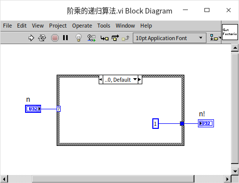
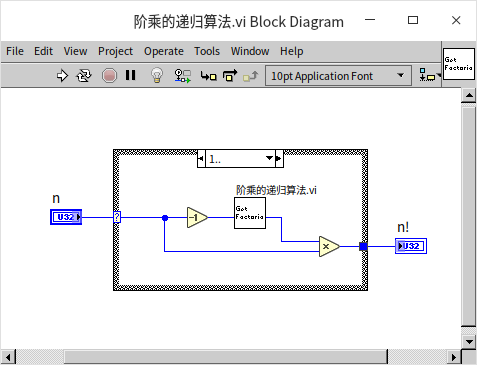
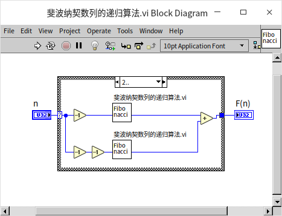

# 可重入VI

重入执行是子VI的一个属性。默认情况下，VI是不会被设置这个属性的；需要设置它时，可以在VI属性对话框中，选中"重入执行"选项。设置了这一属性的VI，称为可重入VI。

图 .12设置VI的可重入属性

如果某个子VI被设置为可重入，那么在程序的不同地方调用这个子VI时，它会在内存中为每一处的调用各生成一个新的VI实例。即，尽管程序在不同地方调用的这个子VI的内容都相同，但是这些子VI在内存中却是相互独立的。如果是非可重入的子VI，在内存中只能有一份实例，所有的调用者都访问这个实例。

被设置为重入执行后，还有两个选项："为各个实例预分配副本"表示每处调用生成的实例VI都拥有各自独立的数据区，它们之间的数据互不干扰。本书后续章节提到的可重入VI，如无特殊说明，都是指这种可重入VI。"在实例间共享副本"是LabVIEW
8.5之后出现的选项，它是指这些实例VI使用同一块数据区。

## 同一VI的并行运行

图
4.13是一个简单的VI，它的程序框图有上下两部分，都调用了同一个子VI。上下两部分的代码之间没有数据线相连。LabVIEW是自动多线程的语言，图中的两个子VI是否会同时运行呢？

图 .13并行的两个相同子VI

如果程序中调用的是两个不同的子VI，LabVIEW有可能会同时在不同的线程执行它们；但对于两处调用相同的子VI，那就得看子VI是如何设置的了。

如果子VI"简单运算.vi"是非可重入的，那么它们一定不会同时运行。LabVIEW一定要等一个执行完，才会执行另一个。

非可重入的子VI在内存中只有一个实例，它的代码和数据都只有一份。在此处调用这个子VI时，它运行所需的数据内容可能都是不同的。若可以同时运行在多处调用的这个子VI，子VI的运行状态和数据就可能发生混乱。所以LabVIEW要禁止这种情况的发生。

VI的这一特性在有些场合表现出了非常好的优点。比如，一个用于读写某个特定文件的子VI
"foo.txt"。应用程序中可能有多处都调用了这个子VI来读写"foo.txt"，如果允许多个线程的程序同时读写它，就很容易造成其内容的混乱。同一子VI不可在不同线程同时运行的特性恰好保护了"foo.txt"，使它不被不同线程同时读写。

但在某些场合，这一特性又显得非常糟糕。比如，有一个用于读写所有文件的子VI。不同的文件应当是可以同时被访问的，但这个子VI却不允许应用程序同时读写不同的文件。需要同时访问几个文件时，也必须一个一个的访问，暂时不能访问文件的那个线程只好等待着。这样，就造成了程序效率的低下。

在这种场合，需要把子VI设置为可重入，以避开同一子VI不可在不同线程同时运行的特性。一个线程正在运行这个子VI时，另一个线程也可以调用它。在LabVIEW中，形象地来看，就是在程序框图的某处，数据流入了一个子VI；在这个框图另外一处，数据也可以片刻不停地同时流入这个子VI。因此，叫做"可重入"。前面已经讲过，应用程序每处调用可重入的子VI时，都生成了一个独立的实例。这就相当于，在应用程序中各处调用的是不同的子VI，只不过这些子VI内部的代码相同而已。既然是不同的子VI，当然也就可以在不同的线程中同时运行。

图 3.12显示的是一个延时子VI的程序框图（延时1秒），而图
4.14是一个调用了这个延时子VI的应用程序，它并行的调用了这个延时子VI两次，那么这个应用程序总的运行时间是多少呢？

图 .14计算程序总运行时间

如果延时子VI是非可重入的，则由于两处调用只能先后分别运行，程序总运行时间为2秒。若延时子VI是可重入的，则两处调用可以同时运行，程序总运行时间为1秒。

## 可重入VI的副本

若可重入VI的多个实例共用一份副本，就意味着它们共用同一数据区。不同实例运行时，可能会把不同数据写入这个唯一的数据空间中，这样就造成了数据的混乱。如果需要可重入VI不同实例会同时运行，并且它们运行时会使用不同的数据，那么就一定要把这个子VI设置为"为各个实例预分配副本"。

图
4.15是一个简单的子VI，这个VI的功能是每执行一次，输出的数据加一。它利用了反馈节点。每次运行这个VI时，反馈节点首先输出上次VI运行后传递给它的数据。VI在此基础上加一，再返回给反馈节点，以便下次调用时使用。反馈节点下方的0是它的初始值，第一次调用VI时，反馈节点给出初始值。

图 .15计算调用次数的子VI

图
4.16是一个调用了“运行次数”子VI的应用程序。执行这个程序后，输出"次数1"和"次数2"分别是几？

图 .16测试运行次数

运行结果同样与“运行次数”子VI的设置有关。程序中两个循环执行次数一为10，一为20。它们之间没有数据连线，所以可以被同时执行。但哪个循环先执行完是不确定的。

如果“运行次数”子VI是非可重入的，则每次运行程序"次数1"和"次数2"的值是不确定的，但它们之间必然有一个为30。虽然循环运行次序不能确定，但是能够确定，运行次数子VI总共被调用了30次，所以它最后一次被调用后，输出的值一定是30。只不过，哪个循环中的VI是最后一次被调用的并不确定。

如果运行次数子VI是可重入的，并且被设置为"为各个实例预分配副本"，那么图
4.16中程序的执行的结果是确定的。"次数1"的值为10，"次数2"的值为20。由于子VI是可重入的，所以程序中的两处调用行为相当于调用两个不同的子VI。他们分别运行，不论运行次序如何，左侧的子VI被调用了10次，而右侧的子VI被调用了20次。

如果运行次数子VI是可重入的，并且被设置为"在实例间共享副本"。那么图
4.16中程序的执行结果是不确定的："次数1"和"次数2"的值可能是小于30的任何一个数值。子VI可重入意味着程序中的两处子VI调用是可以同时运行的。但是，它们共用一个副本，这就造成了数据的混乱。假如，左侧子VI正在运行，内部记录运行次数的数据是8，而这时右侧子VI也同时运行起来，并往内部记录运行次数的数据区写入一个数值3。这样，左侧子VI再读出该数据是就是一个错误数值了。

"在实例间共享副本"虽然会引起数据的混乱，但是它可以大大节约程序的内存。每生成一个副本，就会多消耗一份内存空间。因此，在确保不会发生数据混乱的情况下可以把可重入子VI设置为"在实例间共享副本"。

## 可重入VI的两种数据空间分配方式

LabVIEW 8.6 之后，在设置VI为可重入时，有两个数据空间分配选项：“为每个实例预分配空间”和“让各个实例间共享空间”：

“为每个实例预分配空间”是旧版本LabVIEW（8.6之前）设置可重入VI时的唯一选项。它是指程序在运行前，编译的时候就为每个可重入VI的实例分配好各自的数据空间。比如说这个子VI被主VI在3处不同的地方调用了，那么就分配3份数据副本给它。但是，这种分配数据空间的方式有两个主要的问题。

其一，很多时候程序运行前不能预期会有几处调用到了这一个可重入子VI，比如递归算法就是如此。递归每迭代一次，就需要生成一个新的递归VI的实例。而递归的深度与输入数据有关，在程序运行时才能确定，因此无法预先得知应当分配多少个副本数据空间，也就没法设置为这种模式。

其二，这种设置方式控件效率太低。假设一个可重入VI A，它在主VI中有三处被调用，分别是实例1、2、3。假设程序总共运行3秒，第0秒运行实例1；第1秒运行实例2；第2秒运行实例3。在这个程序整个运行时间内，始终为可重入VI A开辟了三份数据空间，但是每份数据空间都只被使用了很短一段时间，其余时间都没被用到。若是能够重复利用它们，程序可以节约不少内存。

为了解决以上两点问题，LabVIEW又新添了一种为可重入VI 分配数据空间的方式：“让各个实例间共享空间”。笔者觉得这个名称不是特别贴切，可能容易让人误解为：只为可重入VI分配一份数据空间，然后它所有的实例都是用这同一份数据空间。实际情况当然不是这样的，否则就无法保证可重入VI功能的正确性了。

事实上，采用“让各个实例间共享空间”时，每个可重入VI 的实例依然会有它们各自独立的数据空间。程序在逻辑功能上与“为每个实例预分配空间”的方式没有任何区别。唯一的不同在于，数据空间并不是程序一起动就分配好了的，而是只有当一个实例VI被运行到的时候，才为它分配数据空间，而这个实例VI运行结束后，它的数据空间就又被回收回去了。两个同时运行的实例VI是绝对不会共享同一个数据空间的；两个不同时运行的实例VI倒是可以分享同一片数据空间，这已是名称中“共享”的由来。总的来说，如果起名为“动态分配空间”可能会更好理解一些。

还是以上文的可重入VI A为例，若它被设置为“让各个实例间共享空间”，程序开始时，只需要为可重入VI A准备一份数据空间，供实例1使用；程序第1秒的时候，实例1运行结束，它的数据空间被收回，因此实例2还可以继续使用这份数据空间；第2秒时，轮到实例3继续使用者份数据空间。若我们改变一下应用程序的逻辑，把实例3在第2.5秒的时候就运行起来，由于原有的一份数据空间还在被实例2所使用，它不能再分配给实例3，这时候，LabVIEW就会为可重入VI A再开辟一份数据空间，供实例3使用。

“让各个实例间共享空间”的设置虽然提高的程序的空间效率，但它并非只有优点。数据空间的开辟回收都是需要时间和额外的运算资源，因此这个设置是以牺牲时间效率为代价来换取空间效率的提高。

对于一个可重入VI，如果它在应用程序中被调用的地方并不是很多，或者它的各个实例常常会同时运行的，那么就应该把它设为“为每个实例预分配空间”；反之，这个可重入VI会被应用程序频繁的调用，而且每个实例运行的时间都很短，它们的运行时间不大可能会有重叠，就应当把它设置为“让各个实例间共享空间”。用于递归调用时，必须使用“让各个实例间共享空间”方式。

## 递归算法

递归是指一个VI直接调用自身，或者间接调用自身，比如：VI_1调用VI_2，VI_2又调用VI_1。如果大家还记得学习数学的时候有个归纳法，递归可以被看作是把归纳法写成程序。递归的策略是把一个大的复杂的问题转换为一个小的和原问题相似的问题，再进一步把问题拆成更小的问题，最终解决整个问题。理论上，任何需要使用递归调用的地方，都可以用循环结构来代替。但是在某些情况下，使用递归调用的确可以大大简化程序代码的复杂度，有助于缩短编程时间、提高程序可读性。所以，学会如何实现递归还是很有用的。

下面看一个最简单的例子：计算阶乘。计算某个数的阶乘就是用那个数去乘所有比它小的整数。比如3的阶乘写作`3! = 3*2*1`；类似的`6！= 6*5*4*3*2*1`。如果用循环来计算n的阶乘，就是把所有小于n的正整数乘起来就行了：

但是我们还可以换一种方法来考虑如何计算阶乘：我们不是直接从原始的数据开始计算，而是用归纳的方法，一步一步的来简化问题，比如6的阶乘，它可以通过先计算5的阶乘，再把结果乘以6。用公式来描述就是 `0! = 1, n! = n * (n-1)!`，或者写成函数的形式为：`F(0) = 1, F(n) = n * F(n-1)`。数学归纳法中一定要有一个基本情况，对于阶乘的问题，基本情况是0，0的阶乘等于几是人为定义出来的。有的读者可能已经注意到了，用归纳法表示的阶乘与直接计算阶乘不是完全一模一样，归纳法把阶乘计算推广到了所有非负整数，而直接计算，只能计算正整数的阶乘。算是归纳法的一个小优势吧。

下面我们把归纳法公式转换为程序，只要照着公式一模一样的写就可以了。首先处理基本情况，当输入为0时，输出为1：

当输入大于等于1时，VI调用自身，但是输入的值需要减1；然后把子VI输出乘以输入值，输出结果就可以了：

阶乘这个问题过于简单，可能现不出递归的优势。我们可以再考虑一个稍微更复杂一点的问题：斐波纳契数列。
这个问题是意大利人斐波那契在描述兔子生长的数目时用到的:
* 第一个月初有一对刚诞生的兔子
* 第二个月之后（第三个月初）它们可以生育
* 每月每对可生育的兔子会诞生下一对新兔子
* 兔子永不死去

每个月兔子的总数量用数学归纳法来描述就是：
* F(0)=0
* F(1)=1
* F(n)=F(n-1) + F(n-2) （n≧2）

这个问题如果转换为一般的直接数学表达式会非常复杂，有兴趣的读者可以在维基百科查询。但是它的数学归纳法公式却很简洁，所以非常适合用递归算法来解决。首先，还先编写归纳法的基本情况，也就是递归的结束条件，当输入为0和1时，分别输出0和1：

当输入n大于等于2时，VI调用自身两次，一次输入n-1，另一次输入n-2；然后把两个子VI输出的结果想加，输出结果即可：

从以上的例子中可以总结出，编写递归算法可遵循以下的步骤：
1. 明确一个递归结束的条件，也就是归纳法的基本情况。如果递归调用的结束条件设置不当，可能会引起程序死循环甚至崩溃。
1. VI中先放置一个条件结构，检查当前输入是否满足递归结束条件。如果满足返回基础条件设定的结果。
1. 输入值若不满足递归结束条件，则想办法把问题拆分成可以用更小或更简单的相似问题，然后使用更小或更简单的输入调用算法VI自身，得到子问题的结果。
1. 对子问题的结果进行归并处理，得到当前问题的结果。

在考虑是否使用递归算法时需要注意一些事项：
* 递归算法解题通会使得某些问题的解决变得非常简洁，可读性好于非递归算法。
* 合作伙伴如果没有递归编程经验可能会比较难以理解程序代码。
* 任何需要使用递归算法的地方，都可以用循环来代替。递归算法的运行效率通常低于循环算法。
* 参与递归调用的 VI 必须被设置为 "在实例间共享副本" 的可重入 VI。这一设置在 VI 属性对话框的 "执行" 页面：

