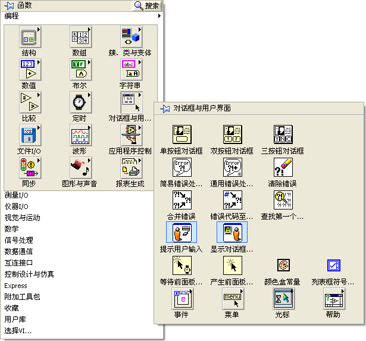
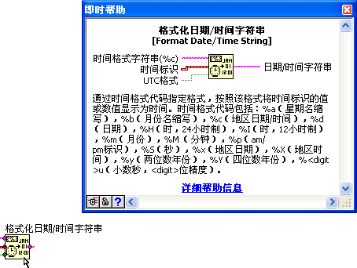
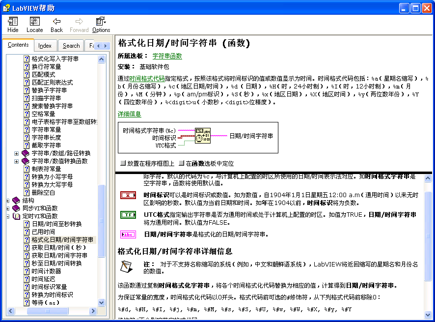
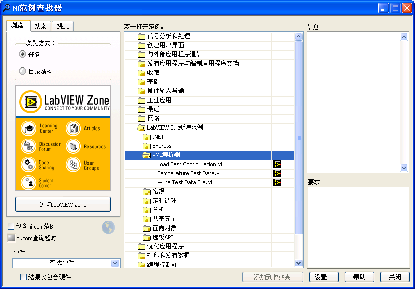
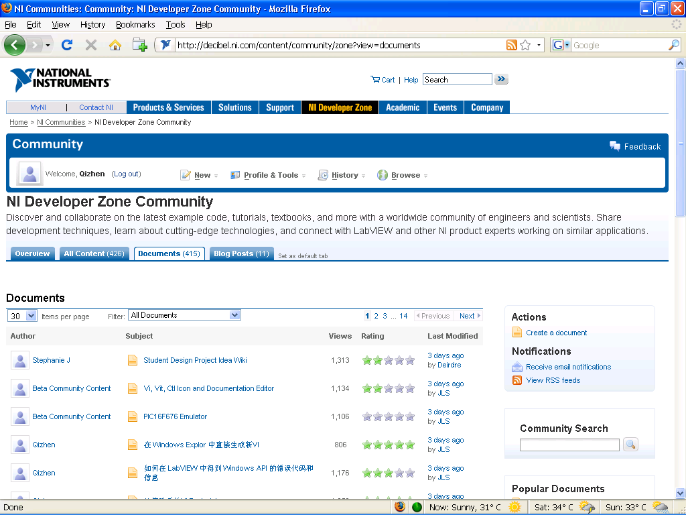

# 如何学习LabVIEW

## 学习LabVIEW的三种方式

古语云："授人以鱼不如授人以渔"。在本书后续的章节中，我们将不再像上一节那样把一个程序的每一步编写都详详细细地进行解释了，而是希望LabVIEW的学习者能够寻找一种适合自己的、高效的学习方式，尽快入门。在此，就先与各位读者探讨一下LabVIEW的学习方式。

学习LabVIEW大致有以下三种方式：系统型学习、探索型学习和目标驱动型学习。这三者之间并不矛盾。每个人可以根据自己的个性特点、所处环境和对LabVIEW了解的程度，选择适合自己的学习方式。

系统型学习是传统的学习方法，在校学生学习大多如此。它是指按照他人制定好的学习方案一步一步地学习掌握一门知识。学习效果如何，除学习者本身因素外，还取决于教师和教材的水平。若选此方案学习LabVIEW，最高效的方式莫过于参加NI公司举办的LabVIEW培训课程。一个从未接触过LabVIEW的学员，通过此培训，基本上可以在一周之内达到编写简单程序的程度。此外，现在国内很多大学都开设了LabVIEW课程，方便了在校生学习。

自学也可以采用此方式。找一本教程类的书籍，按照书中的指导一步一步学习。所选的教程类书籍应当侧重于解释LabVIEW的编程思想以及原理；有些书本仅偏重于罗列LabVIEW中每个函数或VI的功能，这类书籍则不太适合作为此类学习的教科书。

探索型学习方式，则适合喜好自己钻研的人。同样一个知识点，如果是自己探索得到的，要比从他人那里得来的更有成就感，理解掌握更深刻。任何一种教程都不可能覆盖LabVIEW的全部功能。有心者不妨打开那些书中未曾介绍过的菜单或者函数选板，尝试一下它们的功能与作用。在真正动手摆弄每个新东西之前，打开LabVIEW的即时帮助窗口，阅读并弄懂其相关说明，可以大大加快学习过程。

阅读他人的代码也是一种很好的学习方法。自己的探索总是有思维局限性的，"他山之石可以攻玉"，他人解决问题的方法可以大大拓宽自己思路。本书所介绍的编程经验，并非都是作者自己凭空琢磨出来的，有许多地方也借鉴了他人的LabVIEW代码。

目标驱动型的学习方式大概是公司员工最常用的了。踏上工作岗位后，如果不是个人有兴趣，多数人是不会花费时间去学习那些暂时还用不到的知识的，而往往要等到落实了具体项目或者工作任务后再去学习相关知识。这种方法学习效率更高，但学习的内容往往满足于能够解决眼前问题。在这种情况下，请教身边牛人或者公司前辈、同事是最好的学习方法。如果周围的人还不能解决问题，也可以到论坛上发贴，寻求更广泛的帮助。

## 自学LabVIEW

系统型学习方式和目标驱动型学习方式可以满足考试或完成项目的要求。但是要真正精通LabVIEW，学习者自己的探索是必不可少的。探索型学习与其它两种方式的不同之处，在于它的主动性。此外，它的学习内容不局限于教师，或者书籍框定好的范围。

与自学其它文本编程语言相比，自学LabVIEW更容易些，或者说LabVIEW比其他语言更适合采用探索型的方式进行学习。这是由LabVIEW图形化的编程方式所决定的。

首先，图形可以比文字表达更加丰富的含义。同样是一门语言的新手，看到一个LabVIEW函数的图标，他立刻可以猜测到这个函数的大致功能；而看到一个用文字描述的函数，则不一定有如此效果。

例如，在LabVIEW中看到函数，马上就可以知道这个函数是用于计算平方根的。更何况在LabVIEW中，可以根据需要显示出函数的标签（图
1.15）。标签是一段本地化的文字，用以对函数的功能做简短说明。但如果在某一文本编程语言中看到函数sqr()，一位初学者恐怕就不会立刻猜到它的功能了。对于非英语母语的学习者来说，更是如此。

图 .15带标签的函数

其次，LabVIEW已经把编程时需要用到的各种函数、结构、VI等，按照其功能，分类分层次地组织起来，显示在函数选板上了（图
1.16）。

图 .16按照功能分层次组织起来的函数选板

而多数文本编程语言难以把其所有函数按照功能分类列好，以供用户随时选用。例如，在用VC++编写程序时，函数是用键盘一个一个字母敲上去的。假如你的程序中需要把一个浮点数转换为用十六进制表示的字符串，这种常用的功能，肯定可以由现成的函数来完成，可就是不知道这个函数名是什么。于是，不得不翻开各种参考资料查找线索，实在找不到只好自己再重新编写调试一个具有此功能的函数。

若是使用LabVIEW，这个问题就非常容易解决了。初学者也可以大致猜到：如果LabVIEW提供了这样一个函数，那么它或是在"数值"函数选板下，或是在"字符串"函数选板下，或是在某个专门的数据转换函数选板下。只要到这几个地方找一找，就能够找到。

由于LabVIEW已经把它内部的函数组织好了，学习者可以不借助其他参考书，自己就找到感兴趣的函数组，学习它们的功能。比如你预期到将来要写的程序对字符串处理较多，也比较复杂，就可以把"字符串"这一选板下的每个函数都拿出来琢磨一番。将来再遇到类似功能，就知道应该使用何种函数了。

除了函数和控件，还可以自己尝试一下LabVIEW中众多的菜单和配置选项。最常用的有控件的右键菜单和属性配置、VI的菜单和属性配置等。有时候，不经意打开某个菜单选项一试，可能会发现它恰好具有你所需要的某项功能。

读者不妨现在就动手找一下，看看LabVIEW中的While循环在哪儿？简单的数学运算，如加减乘除函数在哪个函数选板中？我们在很快就会用到这些结构和函数。

## LabVIEW的帮助文档

对于最简单的函数或菜单选项等，LabVIEW的用户往往看一眼就可以大致猜测出其用途。再拿来验证一下，就基本可以掌握其用法了。但是对于复杂的函数，单纯依靠自己尝试，效率就比较低了，建议读者在使用它之前参考一下LabVIEW的帮助文档。

LabVIEW的帮助文档是最为有用的学习LabVIEW的工具之一，但却经常被用户忽略。较早版本的LabVIEW只有英文的帮助文档，这给不熟悉英语的学习者带来了很大麻烦。新的中文版LabVIEW的帮助文档也已汉化，用户再也不存在语言障碍了。

最常用的帮助形式是LabVIEW的即时帮助。即时帮助是一个浮动窗口，显示出鼠标所处位置的对象的帮助信息（图
1.17）。鼠标点击前面板或程序框图工具栏最右侧的黄色问号按钮，或者在菜单中选择"帮助-\>显示即时帮助"，或者使用快捷键Ctrl+H都可以显示出快捷帮助的窗口。

图 .17即时帮助窗口

图
1.17所示的例子中，在VI的程序框图上放置了一个"格式化日期/时间字符串"函数。尽管从它的标签就可以猜出这个函数的功能和大致用法，但我们还是无法知道"时间格式字符串"这个参数具体应该怎么写。此时，可以打开即时帮助窗口，鼠标挪到"格式化日期/时间字符串"函数上，即时帮助窗口立刻会显示出有关这个函数的帮助信息，包括常用的时间格式代码的提示。

即时帮助窗口左下方有三个小按钮，它们的功能在此就不再介绍了。读者可以自己尝试着点击它们，然后看看即时帮助窗口有什么变化。（提示：尝试的时候，在程序框图上可以多放几个其它的结构、子VI等，鼠标在几个不同的节点上移动，观察即时帮助窗口的变化。）

即时帮助窗口的简单提示信息对于第一次接触这个函数的编程者来说，也许还是不够详细。点击即时帮助窗口下方的"详细帮助信息"或者左下角蓝色的问号按钮，会弹出更加详细的LabVIEW在线帮助文档（图
1.18）。

LabVIEW的帮助文档详细地列出了LabVIEW中每一个函数的功能、参数的使用方法，恐怕没有任何一本书对于LabVIEW中结构、函数、VI等的解释能够比LabVIEW帮助文档更详尽、更严密、更权威了。所以建议读者在学习LabVIEW的任何一个功能时，都应该首先考虑参考LabVIEW的帮助文档。

图 .18LabVIEW在线帮助

LabVIEW的帮助文档也可以通过LabVIEW菜单中的"帮助-\>搜索LabVIEW帮助"项启动。然后按需要选择帮助窗口左侧的"索引"、"搜索"等选项卡，搜索所需的内容。

LabVIEW的帮助文档虽然详尽，但也并非包罗万象，有些知识是帮助文档无法传授的。比如，功能类似的几个函数，各自适用的场合是什么；如何设计出漂亮的程序界面；如何写出高效的程序代码等。而这些问题，正是本书将要讨论的主要内容。对于LabVIEW帮助中已有的内容，本书会尽量避免重复，仅在必要处提示读者去查看LabVIEW帮助文档中相关的内容。

## LabVIEW的范例

文档对问题的解释总是抽象的，有时不易理解。但如果有相应的示例，往往一看便可明白。

在LabVIEW帮助文档中，某些帮助页面下方会有范例链接，所链接的范例与本页帮助信息有关，如图
1.19所示。用户可以直接在帮助页面点击"打开范例"，查看本页帮助信息是如何在具体程序中体现的。

图 .19 LabVIEW帮助中链接的范例

如果尚未打开相关的帮助文档，也可以通过"NI范例查找器"来查询所需的范例。在LabVIEW的启动界面上选择"查找范例"，或者在菜单中选择"帮助-\>查找范例"即可打开NI范例查找器（图
1.20）。

图 .20 NI范例查找器

NI范例查找器主要有两种查找方式。打开这个工具，在"浏览"选项卡页面，可以按照类型来查找相关的范例。比如想查找如何读写文件，可以在分类列表中选择"基础-\>文件输入与输出"，查看这一类别下的各种范例。若选择"搜索"选项卡页面，可以按照关键字查找范例VI。比如在搜索栏内输入"循环"，就可以找到全部与循环结构相关的范例。

默认情况下，NI范例查找器所找到的范例都是LabVIEW自带的。如果你的电脑已经连接上网，那么，选中NI范例查找器对话框左下方的"包含ni.com范例"选择框，NI范例查找器还能够搜索在NI网站上的所有范例。

NI网站上的范例中，相当一部分是由用户提供的。你也可以把自己编写的VI提交到NI网站上，供他人参考。选择"提交"选项卡，就可以把自己的范例提交给NI网站了。用户提交的VI，被统一放在了一个名为"NI开发者社区"（网址：<http://decibel.ni.com/content/community/zone>）的页面上。用户也可以直接在网页浏览器中打开这个页面，查看最新的、最流行的各种范例，以及他人的评论（图
1.21）。

图 .21 NI开发者社区列出的一些LabVIEW范例

LabVIEW函数选板上的VI，以及vi.lib文件夹下的许多VI的程序框图都是公开的，用户可以打开这些VI的程序框图，仔细阅读推敲，它们也都是极好的学习范例。

本书虽然没有附带光盘，但是书中为讲解每个知识点所编写的VI都已被保存下来，这些VI也可作为范例使用。本书的大部分范例也已经提交至"NI开发者社区"或保存在其它相关的网站上。这些范例同时也保存在这个Github项目中了。

## 寻求他人帮助

在实际编程中遇到的某些具体问题或困难，也许并不能在LabVIEW帮助文档或范例中找到相应的解决办法。这时最有效的方法就是向有经验者请教，包括请教同事、NI的技术支持人员等。如果仍然不能满足需要，可以考虑把问题公布到互联网上，寻求更广泛的帮助。

在互联网上寻求帮助可以考虑几种途径：

-   
-   
-   
-   
-   

NI官方论坛（网址：http://forums.ni.com/ni/）。这个论坛活跃程度很高，并且时常有NI的技术支持和研发工程师来回答问题。论坛有专门的中文讨论区，但如果自己英文尚可，最好是去英文讨论区提问。英文讨论区人气更旺，更容易获得帮助。LAVA（网址：http://forums.lavag.org/forums.html）。这是官方之外最大的LabVIEW社区，也是寻求帮助的好地方。该网站没有官方背景，讨论起来可以更自由些，但这里只能用英文讨论。Windows Live Messenger群。如果你平时用Windows Live Messenger这个通讯工具，那么可以把<msngroup7773@hotmail.com>加为好友，这是个讨论LabVIEW的群。在它上面讨论问题最大的好处是可以即时得到回应。在群上发言，所有在线用户都会即时收到信息。QQ群中也有不少以讨论LabVIEW为主题的，如果你使用QQ作为即时通讯工具，也可上网查找一下相应的群号。在搜索引擎中搜索问题的答案。比如登录Google的网页，对问题的关键字进行搜索。其它论坛、博客等。除了上述几个网站，在其它一些论坛以及LabVIEW高手的博客，都可能会找到学习LabVIEW的有用信息。由于网站数量较多，而且经常变化，所以不在书中一一列出。读者可以到作者的博客页面查看最新的LabVIEW相关网站列表。
