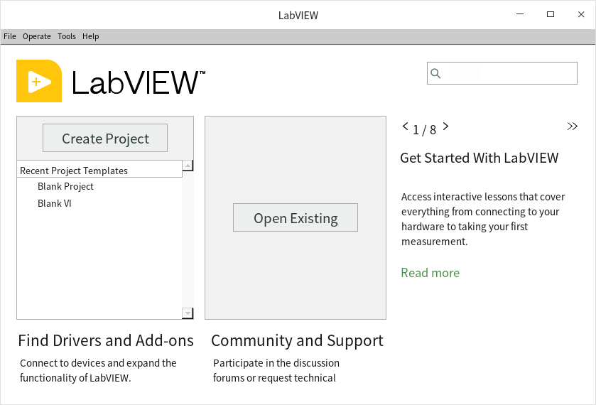

# 安装

大多数读者的电脑上可能都已经安装了LabVIEW了，但如果还没有，可以去NI的官网上[下载社区免费版LabVIEW](https://www.ni.com/en-us/shop/labview.html) 用于学习编程。下载时选择“Community”版本，其它版本需要购买授权之后才能使用。社区免费版与专业版功能基本相同，只是不能用于商业用途。

下载社区免费版需要注册NI社区的账号，在NI网页的右上角选择“Create an Account”就可以免费创建一个账号。软件下载安装后依然会用到这个账号进行激活。

Windows 系统下的安装和激活过程都非常直观，只要根据安装程序的提示一步一步进行即可。

对于Linux系统下的安装需要注意，LabVIEW官方只支持RedHat家族的Linux发行版本。但台式机上安装的Linux大多属于Debian家族，比如Ubuntu、Deepin等。在Debian家族的系统上安装LabVIEW，需要先把安装包里的 .rpm 文件全部转换为 .deb 才可以。具体步骤如下：
首先安装用于转换安装包的工具 alien：
```sh
sudo apt-get install alien
```

然后把下载的LabVIEW安装包解压缩，在解压缩后的文件夹路径下运行如下命令把所有 .rpm 安装包文件转换为 .deb 格式安装包。有一些 rpm 安装包是给32位系统的，可能无法转换，把所有名字中带有“i386”的文件删除即可。
```sh
sudo alien *.rpm --scripts
```

最后，运行下面的命令安装所有的deb安装包：
```sh
sudo dpkg -i *.deb
```

LabVIEW 会被安装到文件夹 `/usr/local/natinst/LabVIEW-20xx-64` 下（把xx替换成对应的版本）。 运行这个文件夹下 `./labviewprofull` 命令即可启动LabVIEW。

Debian不是LabVIEW官方支持的系统，可能会遇到某些问题并无法得到官方支持。所以如果是用于项目开发，请务必选用官方支持的操作系统。但对于学习来说，折腾的越多越有利于拓宽知识面。

LabVIEW 2021 启动后的画面如下，可以选择新建或是打开已有的文件：


如果选择新建，LabVIEW 会提供一些模板以便快速开始一个项目：
