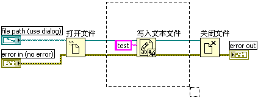
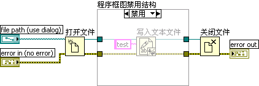

# 程序框图禁用结构

程序框图禁用结构（在本节内，暂且简称为禁用结构）与条件结构有些类似。两者的区别在于：禁用结构并非在运行时输入分支选择条件，它执行哪一分支是在编辑程序时就确定好了的。程序框图禁用结构中可以有多个分支，但是只有一个名为 "启用" 的分支，其它所有分支都是 "禁用"。程序运行时，只运行名为 "启用" 的那个分支。

图 .24 一段简单的写文件程序

在图 3.24 所示的例子中，程序中有一个把字符串 "test" 写入文件的操作，编写程序过程中暂时无法确定最后是否使用它，但两种方案都需要调试。这种情况就应该使用禁用结构。（图 3.24 中的 "打开文件"、"写入文本文件" 和 "关闭文件" 函数均位于 "编程 -\> 文件 I/O" 函数子选板。）从函数选板上拉一个程序框图禁用结构，把这一部分框起来，如图 3.25 所示。这样程序就暂时不会再执行这段位于禁用分支内的、写入文本文件的代码了。当需要运行它时，重新把这个禁用分支设为 "启用" 分支即可。

需要特别注意的是，在写入文件操作被禁用的同时，禁用结构会默认生成一个启用分支。通常需要修改一下启用分支，以保证程序逻辑和输出数据无误。如图 3.26 所示，在这个例子中就需要把文件句柄和错误数据进出结构的隧道分别相连，才能保证后续程序得到正确的数据。

图 .25 程序框图禁用结构的禁用分支

图 .26 程序框图禁用结构的启用分支

在调试程序时常常要用到禁用结构。它的功能与用法与调试 C 语言程序时将某些代码段注释起来相类似，主要用于寻找并定位错误代码。对某段程序代码有怀疑，可以先禁用疑似有问题的部分，以逐步定位并排除错误代码。关于这部分的内容，将在 [查找程序错误的工具和方法](debug_more_tools) 一节另行详细讨论。

程序框图禁用结构还可以用于其它一些场合，比如，在调试程序时，通常需要用写文件的方式记录下程序运行过程中的某些数据，但在程序发布后，就不再需要记录数据了。可以把记录数据文件这部分的代码放置在禁用结构中。调试时，启用这段代码；正式发布程序时，禁用它。

禁用结构中启用哪个分支，是在编辑程序时决定的。运行程序时，禁用分支中的程序并不被生成可执行代码。如果被禁用的分支中包含了子 VI，LabVIEW 也不会把这些子 VI 调入内存。因此，使用禁用结构并不会影响程序的运行效率。而条件结构中执行哪一分支的代码，是程序运行中决定的。所以，LabVIEW 要把每一分支的程序都生成可执行代码，所有用到的子 VI 都装入内存之中。这是禁用结构与一般条件结构的另一个不同之处。

# 条件禁用结构

条件禁用结构的许多特性与程序框图禁用结构类似：它也是在编辑时决定要运行哪一个分支的。两者的区别在于：条件禁用结构是根据用户设定的符号的值来判断决定执行哪个分支上的程序的。它有些类似 C 语言中的 #ifdef 宏。条件禁用结构通常被用在跨平台上的程序中。为使程序能够适用于不同的操作系统，可以为每个操作系统编写各自不同的 VI，但这种方式需要同时维护同一个软件的多个操作系统版本，增加了维护工作量。使用条件禁用结构就可以把针对不同操作系统的代码分别写在条件禁用结构的不同分支内，LabVIEW 会根据 VI 运行的系统选择正确的分支运行。

打开一个 VI，在其中放置一个条件禁用结构。此时，条件禁用结构仅包括一个 "默认" 分支。鼠标右键点击结构的边框，在快捷菜单中选择 "编辑本子程序框图的条件"，弹出 "配置条件框"。"符号栏" 中只有两个符号可供选用，分别是 TARGET_TYPE，和 TARGET_BITNESS。这两个符号分别表示当前 VI 运行目标的操作系统和操作系统位数。假如计算机上安装的是 32 位 Windows
XP 系统，VI 在这台计算机上运行时，就会执行条件禁用结构中 TARGET_TYPE=Windows 或 TARGET_BITNESS=32 分支。

图 .27 使用条件禁用结构处理平台相关代码

图 3.27 是一个条件禁用结构的使用范例。（图中的三个子 VI 均位于 "互连接口 -\>Windows 注册表访问 VI" 函数子选板，依次为 "打开注册表项"、"读取注册表值" 和 "关闭注册表项"。）这段程序很简单，就是从注册表读出一个数据。而 Mac
OS，Linux 等系统是没有注册表的。

那么，是否可以使用条件结构来区分当前的操作系统，选择不同的代码运行呢？在条件结构这一节中已经讲过，条件结构运行哪一分支是在程序运行时决定的。程序装载时，是加载条件结构所有分支的代码的。程序在 Mac
OS 或 Linux 操作系统中肯定找不到这几个注册表操作函数，于是 VI 会显示出错，禁止运行。

为了使这个 VI 也能够在其它操作系统下顺利运行，必须把平台相关的代码都放置在条件禁用结构中。在 Mac
OS 或 Linux 操作系统中，LabVIEW 不会试图装载 "TARGET_TYPE=Windows" 分支中的子 VI，也不会检查这一分支中的代码是否有错。因此，这个 VI 在 Mac
OS 或 Linux 操作系统中能够打开，并正常运行。

条件禁用结构还可以使用项目或项目运行的目标机器所定义的符号。

在项目浏览器的 "我的电脑" 项的鼠标右键菜单中选择 "属性"，弹出图
3.28 所示的 "我的电脑属性" 对话框。

图 .28 项目运行目标机器的属性对话框

图 3.28 是项目运行目标机器的属性对话框中的 "条件禁用符号" 栏，其中添加了一个自定义的符号 "User"，它的值是 "QizhenRuan"。这样就可以在该运行目标机器下的 VI 中使用这一符号了（图
3.29）。

图 .29 使用自定义条件禁用符号

在程序中，有时可能需要为不同的用户定制某些不同的服务：发布给不同用户的软件，基本功能是相同的，但在个别地方需要使用不同的代码。这种情况可以考虑使用条件禁用结构，用它来处理各用户之间有差异的代码。程序发布给不同用户时，只需更改一下项目属性中条件禁用符号的值即可。图
3.29 中使用了自定义的条件禁用符号的程序就是这样的例子。