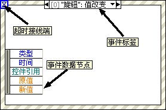
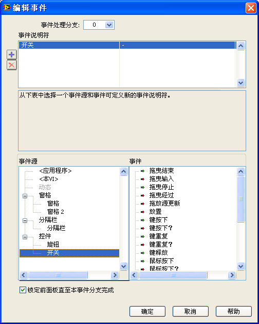
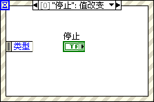
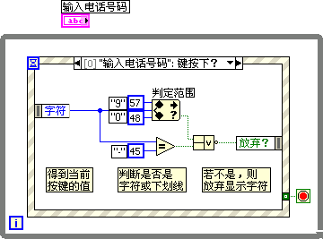
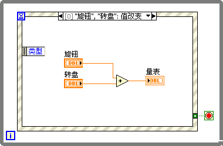
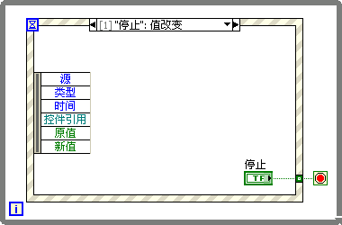
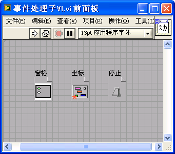
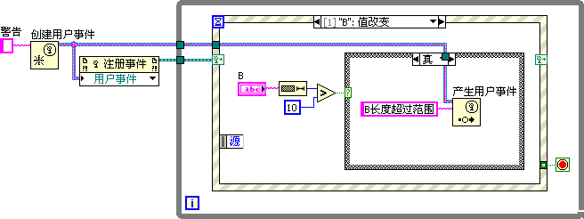

# 事件结构

## 事件结构

事件结构是与 [条件结构](structure_condition) 类似的一种结构。它们的区别在于：事件结构是根据发生的事件决定执行哪一个分支中的代码的。

图 .46 事件结构

当有事件发生时，事件结构会自动感知，并不需要用数据线把事件传递至事件结构。事件结构上方的事件标签显示当前分支所对应的事件。当有事件发生时，事件结构除了会得知是何事件发生，还能得到一些相关数据，比如事件发生的时间，发生在哪一个控件上等。这些数据可以从事件结构左边内侧的事件数据节点得到。

## 按照产生源来区分事件的种类

按照事件的产生源来区分，LabVIEW 程序中的事件可以分为六大类。这六类事件显示在 "编辑事件" 对话框的 "事件源" 一栏中，每一个类别下包含具体的产生事件 VI 或控件等事件源，每一个事件源的具体事件则显示在右侧的 "事件" 栏中。（事件还有其它分类方式，将在接下来几节中另行阐述。）

图 .47 编辑事件对话框

这六大类事件分别是：

### \<应用程序>

应用程序事件，这类事件主要反映整个应用程序状态的变化，例如程序是否关闭，是否超时等。

事件结构中的默认事件 "超时" 就属于应用程序事件。如果不连接任何数据给它，它的默认值是 "永不超时"。在程序中可以传入一个表示毫秒的数值（n）给超时接线端，则每隔 n 毫秒，事件结构会自动运行超时处理分支中的代码。（参考图
3.60）

### \<本 VI>

本 VI 事件，这类事件反映当前 VI 状态的改变。例如，当前 VI 前面板的大小是否被调整，是否选择了菜单中的某一项等。

### 动态

动态事件，用于处理用户自己定义的或在程序中临时注册的事件。我们会在后面详细介绍动态事件。

### 窗格

窗格事件，包括与某一窗格有关的事件，比如鼠标进入离开窗格等。

默认情况下，一个 VI 前面板就是一个窗格。在控件选板上选择 "新式 -\> 容器 -\> 分隔栏" 可以在 VI 的前面板上添加分隔栏，把面板分割成多个窗格（图
3.48）。

图 .48 被划分成两个窗格的 VI 前面板

鼠标右键点击窗格，不会出现与窗格相关的菜单，因为这时出现的是控件选板。只有在滚动条或分隔栏上右击鼠标才能得到与窗格相关的菜单选项。

### 分隔栏

分隔栏事件，包括与分隔栏相关的事件，比如鼠标拖动分隔栏等。

### 控件

控件事件，包括与界面上控件相关的所有事件，比如控件的值被改变等。这是最常被处理的一类事件。

## 编辑事件

条件结构中的条件标签是直接写入的，而事件结构中的事件标签则必须通过编辑事件对话框来编辑。

在事件结构的右键菜单中选择 "添加事件分支"、"复制事件分支" 或 "编辑本分支所处理的事件"，即可调出如图
3.47 所示的编辑事件对话框。

编辑事件时，首先要在 "事件源" 栏中选择一个事件源，比如某一控件；再在 "事件" 栏中选择该事件源所产生的需要被处理的事件，比如选择事件源 "开关" 中的 "值改变" 事件。选中的事件会出现在 "事件说明符" 一栏中。

一个事件处理分支可以处理多个事件，只要把不同的事件加入这一分支的事件标签即可。在编辑事件对话框中，点击 "事件说明符" 一栏左侧的加号，可以为这一分支添加其它可处理的事件。

有时候，用户的一个操作，会使得多个事件产生源都发出某一事件。比如，在图
3.48 中的 "开关" 控件上点击鼠标，"开关" 控件和 "开关" 控件所在的窗格都会发出一个 "鼠标按下" 事件。

不过 LabVIEW 发出这些事件的顺序是有一定规律的：

与键盘相关的事件，如键按下、键释放等，只在当前被选中（当前相应键盘操作的控件）的控件上产生。

与鼠标相关的事件，如鼠标按下，鼠标释放等，按照从外向里的顺序发出。在刚才提到的例子中，在一窗格内的 "开关" 控件上点击鼠标，窗格的 "鼠标按下" 事件先于 "开关" 控件的 "鼠标按下" 事件产生。举一个更复杂一点的例子：在一窗格内，放置一个选项卡控件，选项卡控件上放置一个簇类型控件，簇中包含一个布尔型控件。在布尔控件上点击鼠标，按先后次序发出的事件分别是：窗格中的 "鼠标按下" 事件，选项卡控件的 "鼠标按下" 事件，簇控件的 "鼠标按下" 事件，布尔控件的 "鼠标按下" 事件。

值改变事件按照从内向外的顺序发出。若簇中包含一布尔控件，当布尔控件的值改变时，按顺序发出以下事件：布尔控件的 "值改变" 事件，簇控件的 "值改变" 事件。

图 .49 简单事件处理程序

图
3.49 是一个非常简单的程序，它的前面板上只有一个 "停止" 按钮，程序框图上也只有一个事件结构。这个事件结构中只有一个分支用于处理 "停止" 按钮的 "值改变" 事件。

开始运行这个 VI。当程序运行到事件结构时，就会暂时停止下来，等待事件的发生。而这个事件结构只接受 "停止" 按钮的 "值改变" 事件。其它操作，比如点鼠标、按键等都不会影响到这个程序的执行。

当用户点击 "停止" 按钮时，"停止" 布尔控件的值发生变化，它会发出一个 "值改变" 事件。事件结构捕获到这一事件后，立刻运行事件结构中处理 "停止" 控件值改变事件的分支。执行完这一分支，整个程序也就运行结束了。

## 按照发出时间区分事件的种类

按照事件的发出时间来区分的话，LabVIEW 的事件可分为通知型事件和过滤型事件。

通知型事件是在 LabVIEW 处理完用户操作之后发出的。例如，用户利用键盘操作改变了一个字符串控件的值，LabVIEW 在改变了该控件的值之后，发出一个 "值改变" 通知型事件。用户可以在事件结构中添加处理该事件的代码，在 "值改变" 发生后完成相应的工作。

过滤型事件是在 LabVIEW 处理用户操作之前发出的。如果事件结构中有对该过滤事件处理的分支，那么 LabVIEW 先执行处理该事件的分支，再根据事件结构分支内返回的命令决定是否对该事件做默认的处理。

从标签上，可以明显地区分出一个事件是过滤事型件还是通知型事件。过滤型事件的名称之后都有一个问号，比如 "鼠标按下？" 事件。

从两种事件的含义就可以看出，过滤型事件比相应的通知型事件要先发出。其顺序大致如下：用户动作引发 LabVIEW 发出一个过滤型事件；执行过滤型事件框内的代码；然后根据返回的命令决定是否执行 LabVIEW 默认的处理；最后发出通知事件。

比如，当前界面上选中的是一个字符串控件。用户敲击键盘，LabVIEW 立即发出一个 "键按下？" 事件。如果程序中的事件结构有处理该事件的分支，则 LabVIEW 运行该分支。用户可以在这个分支中添加代码，改变按键的值，或者让 LabVIEW 忽略该操作。如果没有设置让 LabVIEW 忽略该操作，在该事件分支运行结束后，LabVIEW 执行对 "键按下" 的默认处理过程，即把按键所代表的字符在字符串控件中显示出来。LabVIEW 完成默认的操作后，会再产生一个 "键按下" 事件。

举一个实例来说明：编写一个程序，主界面有一个字符串控件，用于输入电话号码。电话号码仅由数字和横线组成，控件对其他按键无反应。

在这个程序中，我们可以利用 "键按下？" 这个事件。在 "键按下？" 发生时，首先判断按下的是什么类型的按键，如果是数字或者横线，则让 LabVIEW 继续显示按键表示的字符，否则要求 LabVIEW 放弃对这个操作的默认响应。

图 .50 用于输入电话号码的控件

图
3.50 显示了这个程序的框图。在事件处理分支的数据节点中可以得到被按下键所代表的字符，字符以 ASCII 码格式表示。程序代码则用于判断按键是否属于数字或横线，并将判断结果取 "否" 后传给 "放弃？" 返回节点，程序将据此决定是否放弃对这一操作的默认处理。这样，当用户键入非数字字符时，让 LabVIEW 放弃处理这些按键，"输入电话号码" 控件就只接收数字或横线了。

若同一 VI 的程序框图上有多个事件结构，当有通知型事件发生时，它会被同时发往所有的事件结构。与处理这个事件有关的所有事件结构分支，将会按照前面讲过的默认的先后顺序，同时处理这一事件。而过滤型事件发生时，它只被发送到某一个事件结构分支，待该事件结构运行处理完成后，再把该事件发往另一事件结构。

可以看出，这种一个 VI 中有多个事件处理结构的形式，其运行逻辑将会是相当复杂和混乱的，因而其可读性与维护性极低。所以，应该尽量避免在同一 VI 上使用多个事件结构。实际上每个 VI 中只需有一个事件结构就可以处理所有的事件了。

## 事件结构的使用

通常情况下，程序不可能只需要处理一个事件，往往在程序运行的过程中不断有需要处理的各种事件出现，所以事件结构通常会被放在一个 while 循环结构内。我们把这种一个事件结构外套一个 while 循环结构的程序模式成为 "循环事件结构"。（图
3.51）

只有在极个别的特殊情况下，才可能单独使用事件结构。例如一个简单的对话框，当对话框被弹出时，只需等待用户点击 "确定" 按钮，然后退出。程序不需要响应任何其他事件。这时可仅使用一个事件结构完成程序功能（图
3.49）。

现在，我们回过头，重新看一下图
1.29 中的程序，这个程序还是不够完善。程序设定了每隔 200 毫秒做一次加法运算，并更新 "量表" 显示控件的值。但在软件运行的绝大部分时间里，两个输入控件的值是不变的。也就是说，在这绝大部分时间里，程序所作的加法运算和更新显示控件工作都是无效的。但是，我们又不能够把每次计算的时间间隔调整得过长，否则在控制控件更新后，会明显地感觉到显示控件的更新滞后。

理想的解决方案应当是，程序一直处于空闲状态，而一旦控制控件的值更新了，就立即进行运算并更新显示控件。循环事件结构恰好可以满足这一需求。

图 .51 利用事件结构监视控制控件的值改变

图
3.51 是使用循环事件结构改写后的程序，它的主要事件分支是 "旋钮，转盘：值改变" 事件。程序的执行顺序如下：首先执行 while 循环，while 循环开始第一次迭代，程序执行 while 循环内部的代码，即事件结构。由于这个事件结构中还没有任何需要处理的事件发生，程序一直处于等待事件的状态。程序处于等待状态时，并不占用系统资源。一旦 "旋钮" 或 "转盘" 的值发生改变，程序就会立即运行并执行 "旋钮，转盘：值改变" 事件处理分支。于是，程序运行加法计算并及时更新显示控件。

程序执行完这一事件处理分支后，跳出事件结构。此时，传递给 while 循环条件接线端的是默认值 "假"。于是 while 循环继续运行，开始下一次迭代，重新进入等待事件状态。

这个事件结构还有另一分支，用于处理 "停止" 按钮的 "值改变" 事件。当 "停止" 按钮值改变时，按钮的值 "真" 传递给了 while 循环条件接线端，于是 while 循环停止运行，程序结束（图
3.52）。

图 .52 停止按钮事件处理分支

根据作者的经验，程序如需处理布尔控件的值改变事件，必须把这个布尔控件的接线端放置在事件结构的某一处理分支内，否则程序可能会出错。版本越早的 LabVIEW 越容易出现问题。

那么，能不能在循环事件结构内还采用图 1.29 那样的停止程序方式呢？

图 .53 让 "停止" 按钮直接控制 while 循环条件接线端

分析一下图 3.53 所示程序的运行流程。程序其它部分的流程与图
3.51 中的程序是相同的。当程序处于等待事件状态时，如果这时按下停止按钮，按钮的值改变了，但由于没有事件结构可处理的事件发生，程序还是继续处于等待状态。程序就卡在事件结构这里了，并不会像预期的那样结束循环。所以，退出这一循环事件结构唯一有效的处理方法是使用 "停止" 按钮值改变事件。

循环事件结构非常适合应用于界面编程，所以它是 LabVIEW 中最常见的程序模式之一。我们在下一章会更详细地讨论这一结构。

## 动态事件

在初始状态下，打开编辑事件对话框，动态事件下的一栏是空的。这是因为动态事件只有在注册过之后才能使用。与动态事件相关的节点位于 "编程 -\> 对话框与用户界面 -\> 事件" 子函数选板。

用于注册事件的节点是 "注册事件" 节点。注册事件节点可以注册两种事件，一是 LabVIEW 自产的事件，包括我们前面介绍过的所有的应用程序事件、VI 事件、窗格、分隔栏和控件事件；二是用户自定义事件。

我们首先讨论 LabVIEW 自产的事件。这些事件均可在编辑事件对话框中直接选择。除 "动态" 这一项以外，可以直接在编辑事件对话框中选择的事件都属于静态事件。静态事件只能是本 VI 的对象发出的事件。比如，VI 前面板有一布尔控件，在它的程序框图的事件结构中就可以直接添加处理这个控件事件的分支。但是，在编写一些比较复杂的程序时，会使用大量的子 VI，或动态调用其它 VI（有关动态调用的详细内容，在本书后面相关的章节再做阐述）。有时候可能会遇到这种情况：在某个 VI 的事件结构中必须处理另外一个 VI 的控件发生的事件。比如，布尔控件在某程序的界面上，而处理它的事件的代码却在某一个子 VI 中。很显然，子 VI 中并没有这个控件，那么它的编辑事件对话框肯定也是找不到这个控件的，也就无法设置这个控件的事件分支。在 LabVIEW 中，为处理这一类情况设置了动态事件。要使用动态事件，首先这个控件需要在其子 VI 的事件结构中注册。

需要注册某一事件时，首先要为产生这个事件的控件生成一个引用节点，将引用节点与 "注册事件" 节点下方标志了 "事件" 字样的事件源相连，鼠标点击事件源，在弹出的菜单中选择所需的事件。然后，把注册事件节点生成的 "注册事件引用句柄" 传递给事件结构的 "动态事件接线端"，即可完成事件的注册。

用文字讲述这一过程比较复杂，不妨使用一个例子详细解释这一过程，就容易理解多了。

编写一个 VI，在 VI 的面板上点击鼠标时，显示出鼠标所在的坐标，并且在子 VI 中处理所有的事件。

程序主 VI 的界面如图
3.54 所示：当用户在 VI 面板上点击鼠标时，"坐标" 控件显示出鼠标的位置；当用户点击 "停止" 按钮，程序结束运行。

图 .54 主 VI 界面

由于这个程序处理事件的主要代码部分，都要求在一个子 VI 内完成，所以主 VI 的程序框图是非常简单：它只要把子程序所需的数据传递给子程序就可以了（图
3.55）。

程序要求一个 VI（子 VI）监视和控制另一个 VI（主 VI）的控件，那就必须提供一种机制，让子 VI 可以找到并控制主 VI 上的控件。在 LabVIEW 中，可以为控件产生一个 "引用"。使用过文本编程语言的用户，也许对 "引用" 这个概念比较熟悉。"引用" 是指向一块数据的内存地址。在 LabVIEW 中，"引用" 是一个 4 字节的数据，程序可以通过它得到其指向的复杂数据对象。

控件是一个比较复杂的对象，由数据以及各种属性组成。要是在 VI 间直接传递所有这些内容，效率肯定不高。但如果使用一个 4 字节的简短数据来表示它，再进行数据传递，效率就高多了。

图 .55 主 VI 程序框图及控件的引用

在控件或控件的接线端上点击鼠标右键，选择 "创建 -\> 引用"，即可为控件创建一个引用。把某个控件的引用传递给子 VI，子 VI 就知道了存储这个控件所有信息的内存地址，也就可以对这个控件进行控制操作了。

在这个例子中，我们要检测鼠标在前面板上的点击动作。这个前面板只有一个窗格，所以需要把窗格的引用也传递给子 VI。在前面板的滚动条上右击鼠标，可以为窗格创建出一个引用。

子 VI 有三个参数，分别接收主 VI 传递来的三个引用，它们的参数类型应当分别是这三个引用类型。"引用" 虽然是用来指向某一数据的，但引用本身也是一个数据。引用数据本身在 LabVIEW 中的传递方式与其它数据是相同的。

唯一的麻烦是，在 LabVIEW 的控件选板中，无法找到针对某一特定对象的引用控件。因为某个控件的 "引用" 只与这个特定控件相关联，所以不可能在控件选板中列出无数个控件引用来。需要使用这种 "引用" 控件时，最简单的办法是从 "引用" 直接创建出同数据类型的控件。分别在图
3.55 程序框图中的三个 "引用" 上点击鼠标右键，选择 "创建 -\> 输入控件"，即可产生与这三个引用数据类型想对应的 "引用" 控件。在把产生的控件拷贝至子 VI 主面板中即可（图
3.56）。

图 .56 子 VI 前面板的三个引用控件

在子 VI 中处理主 VI 控件的事件，首先要注册需要处理的事件，如图
3.57 所示。把 "窗格" 和 "停止" 的引用分别传递给 "注册事件" 节点的事件源输入端，鼠标单击事件源输入端，选择需要注册的事件类型。

注册事件节点生成的 "注册事件引用句柄" 需要传递给事件结构的 "动态事件接线端"。在事件结构的右键菜单中选择 "显示动态事件接线端"，事件结构的框架上会多出一个如同卫星天线图案的小矩形，这就是动态事件接线端。把 "注册事件引用句柄" 数据引入这里，即可允许事件结构使用已注册的事件。再次调出编辑事件对话框，会发现
"动态" 一栏下，已经多出了刚才注册过的那两个事件。

图 .57 子 VI 程序框图

需要注意的是，动态事件是指引用控件所指向的内容（另一个控件）的事件，千万不要把它与引用控件本身的事件混淆。

"\<窗格>：鼠标按下" 事件处理分支中的代码是将事件结构所得到的事件发生的位置（即点击鼠标的坐标），传递给主 VI 上的 "坐标" 控件，显示出来。我们可以通过把数据传递给控件的 "值" 属性来完成这一功能。

本书在第 2.4.5 节曾经介绍过如何为控件创建属性节点。但是，从控件直接创建出来的控件属性节点只能在控件所在的 VI 上使用。如果需要读写其它 VI 上的控件的属性，也必须通过控件的引用完成。

把某控件的引用传递给 "编程 -\> 应用程序控制 -\> 属性节点" 的 "引用" 输入端，即可在属性节点下方的属性数据接线端选择该对象的属性了。它与从控件直接创建出来的属性节点的功能是完全相同的。

## 用户自定义的事件

LabVIEW 自产的事件主要是指那些由用户对界面对象进行操作的事件，比如在某处点击鼠标，改变某个控件的值，以及程序自身状态变化（如 "超时"）的事件。如果需要在程序中，在满足其它某种条件时也产生一个事件，就只能使用用户自定义事件了。

用户自定义的事件被归纳在动态事件中，在用户自定义事件被注册后，即可在 "编辑事件" 对话框的 "动态" 栏下找到它。用户自定义事件是使用 "创建用户事件" 函数创建出来的事件。当需要抛出（指产生一个已经定义好的事件）一个用户自定义事件时，可以使用 "产生用户事件" 函数发出一个事件。程序抛出的用户自定义事件还可以携带自定义的某些数据。

还是举一段例程来说明。程序有两个输入控件：一是数值型控件 A，二是字符串控件 B。当 A 的值大于 10，或者 B 的长度大于 10 个字符时，程序抛出一个用户自定义事件 "警告"。

要实现这个功能其实可以有多个方式。使用用户自定义事件是一种较为简便的方案。

图 .58 创建和抛出用户自定义事件

图
3.58 是这个程序的程序框图。首先，创建一个用户自定义事件。创建用户自定义事件时，需要连接一个常量数据给 "创建用户事件" 函数的 "用户事件数据类型" 参数。常量的数据类型，就是抛出事件的事件数据类型，常量的标签则是创建出来的事件的名称。

此处，我们需要一个字符串类型的事件数据，用以在抛出 "警告" 事件时，传递警告信息。为此，我们为 "创建用户事件" 函数的 "用户事件数据类型" 参数指定了一个标签为 "警告" 的空字符串常量。

在事件 "B：值改变" 事件的处理分支中，程序检测字符串 B 的长度，如果长度超过 10，则程序抛出 "警告" 事件。同时把字符串 "B 长度超过范围" 作为这个事件的数据。

图 .59 \<警告> 事件的处理分支

在用户自定义的处理分支中，可以从事件结构左侧的数据节点中得到事件的数据（图
3.59）。

自定义用户事件可以作为一种规范的格式，用在 VI 的初始化、终止等场合，处理 VI 被调用或开始运行时首先需要处理的事情，以及 VI 终止前必须处理的事情。（参考本书 [界面程序](pattern_ui) 一节）