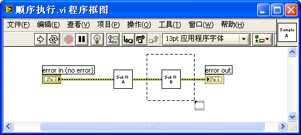
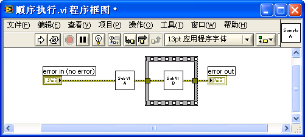
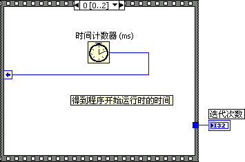
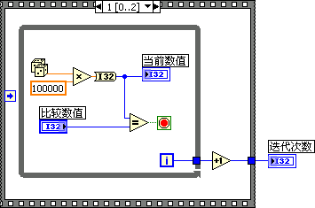
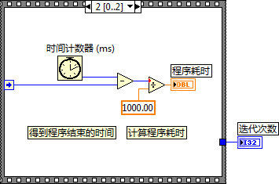
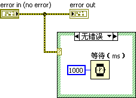

# 顺序结构

## 程序执行顺序

LabVIEW 是数据流驱动的编程语言，程序沿着数据在连线上的流动方向顺序执行。LabVIEW 又是自动多线程的编程语言。如果在程序中有两个并行放置、之间无任何连线的模块，则 LabVIEW 会自动把它们放置到不同的线程中，并行执行。

图 .1 顺序执行的程序

图 3.1 是一个程序顺序执行的例子：数据从控制控件（error
in）接线端流出，流经子 VI"SubVI A" 和 "SubVI B"，最后流入显示控件 "error
out"的接线端。这个程序的执行顺序也就是数据流动的顺序：先运行"SubVI
A"，再运行"SubVI B"。

图 .2 并行执行的两个 VI

图 3.2 是两个 VI 并行执行的例子：子 VI"SubVI A" 和 "SubVI
B"之间没有数据线相连接，LabVIEW 认为这两个子 VI 没有先后顺序依赖，就会同时运行这两个子 VI。子 VI"Merge
Errors.vi"（打开函数选板" 编程 -\> 对话框与用户界面 -\> 合并错误.vi"，参见其帮助文件。）与"SubVI
A"和"SubVI
B"之间均有数据线相连，它所需的输入数据是由这两个子 VI 输出的。所以这个 VI 的执行顺序是：子 VI"SubVI
A"、"SubVI B"同时开始运行，当它们都执行结束后，子 VI"Merge
Errors.vi" 得到了全部输入数据，开始执行。

## 创建顺序结构

没有数据线相连的各函数或子 VI 之间，也可能需要有执行顺序的依赖关系。比如图
3.2 中的程序，假设 "SubVI A" 完成的工作是在某文件中写入一个数据，而 "SubVI
B"需要从文件中读出此数据。那我们就知道，程序应当按顺序执行完"SubVI
A"，再执行"SubVI
B"。然而，它们之间没有数据线相连，我们需要将它们的顺序关系以另一种方式告诉 LabVIEW。

要让相互之间没有数据线相连的几部分代码，按照特定顺序执行，可以使用顺序结构。在函数选板中选择 "编程 -\> 结构 -\> 平铺式顺序结构" 或 "编程 -\> 结构 -\> 层叠式顺序结构"，就可以在程序框图上放置一个顺序结构。

初次被放置在程序框图上的是一个深灰色的方框，这是一个只有一帧的顺序结构。在顺序结构的右键菜单中选择相关的选项，可以为顺序结构添加新的帧。结构的每一帧内都可以放入程序代码。平铺式顺序结构与层叠式顺序结构的功能完全相同，它们的区别仅仅在于：平铺式顺序结构可以把所有的框架按照从左到右的顺序展开在 VI 的框图上；而层叠式顺序结构的每个框架是重叠的，每一时刻都只有一个框架可以直接在 VI 的框图上显示出来。

当程序运行到顺序结构时，会按照帧的顺序依次执行每一帧。平铺式顺序结构按照从左到右的顺序依次执行每一帧的代码。层叠式顺序结构的框架正上方显示有每一帧的编号，程序按照编号顺序执行每一帧。

在程序框图上放置顺序结构时，可以先在程序框图的空白处放置一个结构，再在结构体内添加代码。也可以把程序框图上已有的代码，直接放置在新添的结构体内。具体操作方法是：在函数选板上，选择顺序结构；然后在程序框图的那些打算放入结构的代码的左上方按下鼠标左键，拖曳出一个包含所有需要放入结构的代码的矩形；释放鼠标，就创建了包含指定代码的结构。过程如图
3.3、图
3.4 所示。（放置顺序结构的这两种操作方式，对 "结构" 选板的其余结构也适用。我们在后面讲述其它结构时，就不再重复了。）

图 .3 拖拽鼠标，划出矩形范围

图 .4 添加新的结构，并包含已有代码

## 层叠式顺序结构

假设需要编写一个 VI，用于测试某一段程序代码运行所耗费的时间。考虑的思路是：在被测试代码运行前，记录下当时的系统时间，然后运行被测试代码。被测试代码运行结束时，再记录下新的系统时间。这两个时间之差就是被测代码运行的时间。

由于记录时间的代码部分，与被测试的代码部分并无数据线相连，而它们之间又必须以一定的先后顺序执行，所以可以考虑使用顺序结构。

图 3.5、图 3.6 和图
3.7 分别是这个程序的层叠式顺序结构的三个帧。其中第二帧中的代码是被测试代码。它的功能是，每次循环迭代产生一个随机数，直到这个数字与给定的 "比较数值" 相同，才退出循环。（函数 "时间计数器 (ms)" 位于 "编程 -\> 定时 -\> 时间计数器" 函数选板；
图 3.6 中的函数 "随机数 (0-1)" 位于 "编程 -\> 数值 -\> 随机数" 函数选板。）

图 .5 第一帧

图 .6 第二帧

图 .7 第三帧

在编写这个程序的时候，遇到了一个小麻烦：第三帧需要用到第一帧提供的起始时间。也就是说，在第一帧产生的那个时间数据，需要传递到第三帧中去。由于两个接线端不在同一帧上，无法直接将这两个接线端连线。

在此情况下，需要借助 "顺序局部变量"。在顺序结构的边框上点击鼠标右键，选择 "添加顺序局部变量"，即可为顺序结构创建一个顺序局部变量。该顺序变量在未与输入数据连线时是一个淡黄色的小矩形。把第一帧中 "时间计数器" 函数的输出值与新创建的顺序局部变量相连，数据就传给了它。该顺序局部变量与输入数据线相连后，小矩形内生成了一个与数据线颜色相同的箭头。在后续的那些帧中，可以根据需要，通过连线，把顺序局部变量中的数据引出来。

顺序局部变量上的箭头表示数据流动方向：箭头指向边框表示数据流入；箭头离开边框表示数据流出。在循环结构中，每一个顺序局部变量只能选择其中一帧将数据写入，其后的所有帧都可以从中读取写入的数据。而在这之前的任何帧中，顺序局部变量仍然是个实心矩形，表明在这些帧中，都不能读写它。层叠式顺序结构的代码可读性比较差。在程序框图上，层叠式顺序结构每次只能显示一帧。用户无法直接看到其它帧的代码，因而也难以快速了解整个程序的功能。

流入或流出顺序结构的数据在通过顺序结构时，在结构边框上形成一个颜色与数据线相同的小矩形。这个小矩形叫做隧道，负责把数据传进或传出结构。在层叠式顺序结构中，对于输入隧道，每一帧均可从它读出数据；对于输出隧道，只能有一帧与其相连，写入数据。在其它结构中，也都有隧道，它们的功能十分类似。

当数据进出顺序结构时，在层叠式顺序结构上难以一眼就找到数据接收节点或数据源。比如图 3.6 中，数据从顺序结构流到 "迭代次数"；然而，在图 3.5、图 3.7 中，我们看不到这个数据是如何产生的，只有等到顺序结构切换到第 0 帧，才能找到数据来源。对于这个只有三帧的顺序结构来说，翻看一遍所有的帧，并不困难。但是，如果程序比较复杂，顺序结构超过七八帧以上，要搞清楚整个结构的功能就比较麻烦了。

顺序局部变量的使用，使得层叠式顺序结构的可读性雪上加霜。首先，顺序局部变量与隧道一样，只能通过翻看结构中的每一帧来找到数据源和接收数据的节点。其次，由于一个顺序局部变量在每一帧的位置都是固定的，必然导致某些数据线上数据流动的方向与习惯不符。

大多数人在书写文字的时候，都是按照从左到右的顺序。所以，如果程序也从左到右地执行，就比较符合大多数人的自然习惯。编写 LabVIEW 程序的时候，也应该让所有数据的流动方向是从左到右。也正是遵循了这一原则，几乎所有的 LabVIEW 的函数和子 VI 都把输入参数放在左侧，输出参数放在右侧。

但是数据在流入流出顺序局部变量时，总有一段连线要违背这个原则。例如图
3.5 中的程序，顺序局部变量在左侧，数据从时间计数函数流出后，只好向左流动至顺序局部变量。如果把顺序局部变量放在右侧，写入时数据流动是从左向右了，但图
3.7 读出时数据流动又从右向左了。

## 平铺式顺序结构

在图
3.5 中的顺序结构框上点击鼠标右键，选择 "替换 -\> 替换为平铺式顺序结构"，可以将层叠式顺序结构替换成功能相同的、如图
3.8 所示的平铺式顺序结构。平铺式顺序结构的可读性比层叠式顺序结构好得多。

图 .8 应用平铺式顺序结构

平铺式顺序结构可以在程序框图上展开显示结构中所有的帧，不再需要使用顺序局部变量。用户对整体程序结构可以一目了然，如在图
3.8 的程序中，一眼就可找到 "迭代次数" 数据的来源。

平铺式顺序结构从左到右依次执行各帧的代码，在每一帧中也是从左到右执行各代码，这样保证了从左至右的整体程序的执行顺序。

平铺式顺序结构的可读性较好。因此，在需要使用顺序结构时，应当首先考虑使用平铺式顺序结构。当然，层叠式顺序结构也有其优点：它占用的程序框图显示面积较小；另外，它可以很方便地调整每一帧的先后顺序（在层叠式顺序结构的右键菜单中选择 "本帧设置为......"）。

## 无形胜有形的最高境界

武侠小说中常常说：练剑的最高境界就是手中无剑。套用到顺序结构上来说，使用顺序结构的最高境界就是不用顺序结构。

以一个简单程序为例：要求在程序中设置一台仪器，再从仪器读取一个数据。但在设置后，需要等待一小段时间，设置才会生效，才可以开始读数为此，我们需要在设置仪器和读取仪器数据之间插入一个一秒钟的延时，以避免读数有误。

图 .9 一个测试应用程序的代码

图
3.9 所示的程序是不能满足上述要求的。这段程序的延时代码与读写仪器的代码之间没有数据线连接，LabVIEW 就会同时执行这两段代码。所以，尽管这段程序的总运行时间会延迟至 1 秒，但读写部分的代码并不受延时的影响。程序在执行完设置仪器子 VI 后，立即执行读取仪器数据子 VI，致使读取数据错误。

在讲述这个例子是，用到的 "设置仪器.vi" 和 "读仪器数据.vi" 是两个演示用的子 VI，在标签中已表明其功能；"仪器名称" 是输出为句柄类型数据的常量；两个子 VI 之间下方的连线是错误数据线，相关内容将在第 3.2.1 节、第 4.1 节中详细阐述；"等待（ms）" 为 LabVIEW 自带的函数，位于 "编程 -\> 定时 -\> 等待" 函数选板。

如图 3.10 所示，利用顺序结构才可以确保程序的时序正确：

图 .10 使用顺序结构

其实，图
3.10 中的代码还可以有所改进。在这个程序中，我们只需要保证 "等待" 函数的执行顺序，没必要把其它代码也挪入顺序结构中。改进后的程序如图
3.11 所示：只把 "等待" 函数放入顺序结构中，通过进出顺序结构的数据线控制各子 VI 的执行顺序。改进后的程序，看起来就干净利索多了。

图 .11 缩小顺序结构的使用范围

大家也许已经注意到，在这个程序中，真正控制程序执行顺序的已经是数据连线，而不再是顺序结构了。代码通过改变数据连线方式，控制数据的流动顺序，从而控制了程序的执行顺序。既然数据连线才是 LabVIEW 中最普遍的控制程序执行顺序的方式，那就完全可以在程序中通过合理布线，替换所有的顺序结构。

回过头来再看一看图
3.11 中的程序，它依然存在着一个比较严重的问题。按照程序的逻辑，程序在执行 "设置仪器" 时，无论是否出错，都得继续执行 "等待" 函数，程序延时 1 秒才会结束。而理想的方案是，一旦 "设置仪器" 时出错，程序应当立即退出。

完成这个功能的最佳方案是，把程序的延时部分做成一个子 VI（图
3.12）。该子 VI 利用条件结构设定，只有 "error
in"输入" 无错误 "时，才执行延时。（在第 3.2.1 节" 条件结构 " 中，我们将详细讲述这种错误选择框的功能和用途。）

图 .12 延时子 VI

整个程序经过优化后，就成了图
3.13 的样子。我们可以看到，利用错误连线来控制程序执行顺序大大增强了程序的可读性。

图 .13 使用延时子 VI 的测试程序代码

使用这种方法，移走所有的顺序结构，是使得程序代码更有效更美观的重要手段之一。比如图
3.8 中的程序，我们只要把每一帧中的代码都做成一个子 VI，并且这个子 VI 具有错误输入输出参数。就可以把它们改造成如图
3.13 一样的由几个子 VI 顺序连接组成的简单易懂的程序了。

## 练习

* 链接是书中用到的一个示例 VI：“[计算斐波纳契数的 VI](https://github.com/ruanqizhen/labview_book/blob/main/code/% E5% B8% B8% E7%94% A8% E7% A8%8B% E5% BA%8F% E7% BB%93% E6%9E%84% E6% A8% A1% E5% BC%8F/% E5%8F% AF% E9%87%8D% E5%85% A5VI/% E6%96%90% E6% B3% A2% E7% BA% B3% E5% A5%91% E6%95% B0% E5%88%97% E7%9A%84% E9%80%92% E5% BD%92% E7% AE%97% E6% B3%95.vi)”。这个练习不需要了解它的功能，只需要编写一个新的 VI 来测量一下这个 “斐波纳契数的 VI” 在输入分别为 10，13，16 时的运行时间。注意输入的数值不要大于 20，否则可能会引起 LabVIEW 崩溃。