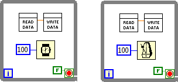
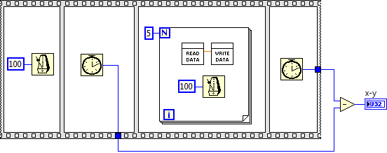

# 定时结构

LabVIEW 程序中，常常会遇到需要定时执行某一段代码的情况。按照定时的精度区分，有些程序对定时的精度要求很低。例如，图
1.29 中的程序就是一段定时程序。它设定每 200 毫秒程序执行一次计算和刷新界面。这个程序对定时的精度要求是很低的，虽然它设定的是 200 毫秒，但实际上，即便时间出现 50% 的误差，都不会对程序运行产生什么影响。但有些程序对定时的精度要求非常高。比如，在利用数据采集设备对信号进行采集时，其精度要求可能是前面提到的程序的数千倍以上。高速数据采集时，时间误差要求甚至于高达 10^-9^ 秒的级别。

## 定时函数和 VI

LabVIEW 程序若要完成定时功能，也有多种方法。最简单的方法是利用 LabVIEW 提供的几个定时函数和 VI。常用的几个与定时相关的函数或 VI 都在函数选板 "编程 -\> 定时" 中，包括 "时间计数器"、"等待"、"等待下一个整数倍毫秒"、"时间延迟" 和 "已用时间"。

图
3.8 中的程序使用了两个 "时间计数器" 来计算某一段代码执行所需的时间。如需定时，只要不停地检测当前时间，如果当前时间与上次执行任务间隔了特定的时间，就再次执行任务，这样就完成了定时功能。

"已用时间"VI 的用法和 "时间计数器" 类似，但是 "已用时间"VI 提供了更多的功能。

更简单的定时方法是直接使用 "等待"、"等待下一个整数倍毫秒" 或 "时间延迟" 函数，这三个函数的用法是完全相同的。它们可以分辨的最小等待或延时时间也是相同的：
2 毫秒。它们唯一的差别在于精度。"等待" 与 "时间延迟" 的精度是相同的，它们每执行一次的误差可达数个毫秒。"等待下一个整数倍毫秒" 的精度要高一些。

因此，像图
1.29 中的程序，不需要太高精度，使用 "等待" 与 "时间延迟" 均可。如果，是一个数据采集程序，精度要求不太高，可以考虑使用 "等待下一个整数倍毫秒" 函数。如果精度要求更高，则需要再考虑其它定时方法。

LabVIEW 程序中需要定时的时候，最常使用的方法是 "等待"
与 "等待下一个整数倍毫秒" 这两个函数（图 3.60）与循环配合。因此，下文将着重比较一下这两个函数。

\
图 3.60

"等待" 函数比较容易理解：给定一个输入参数
n 毫秒，每次程序执行到它的时候，它就会停下来，等待 n 毫秒，再继续运行后续程序。

"等待下一个整数倍毫秒" 函数稍微复杂一点：给定一个输入参数
n 毫秒，每次程序执行到它的时候，会暂停在这里，函数每隔 n 毫秒醒来一次，醒来后再继续运行后续程序。

一般情况下，若程序并不要求非常精确的计时，则 "等待" 与
"等待下一个整数倍毫秒" 的区别不大，选用哪个函数都可以。只有在计时精度要求较高的时候，才需要考虑它们之间的细微差别。

\
图：3.61 循环框内的定时函数

单纯解释概念比较抽象，还是用程序来演示一下。假设图 3.61 程序中 "Read Data"
和 "Write Data"
函数的运行时间都是 n 毫秒（在本章节随后的其它图例中，这两个子程序的运行时间均是 n 毫秒）。若
n\<50，在默认情况下，上图的两个程序，循环每迭代一次，所需时间大约都为 100 毫秒。

** 精度 **

但是，两个程序的计时精度是不同的。在循环框内使用 "等待下一个整数倍毫秒"
函数的精度远高于使用 "等待" 的精度。

在 Windows 这样的非实时操作系统中，定时函数的精度是非常低的，每运行一次出现几毫秒误差是正常的现象。

使用 "等待"
函数，每次循环运行到它时才开始计时，因此单次的误差会被累积。假如每次误差四、五毫秒，迭代五次误差就可能达到十几毫秒了。

而 "等待下一个整数倍毫秒"
函数，并非是在每次调用的时候计算延时的。假设函数从 0 时间开始计时，那么程序一开始运行，它就知道自己每一次醒来的时间分别应当是：100ms，
200ms，
300ms......。假如误差是 ±4 毫秒，那么它实际每次醒来的时间就是 100±4ms,
200±4ms, 300±4ms......，这个误差不会被累积。

图 3.61 两种定时函数的累积误差

** 第一次迭代的时间 **

运行下面两段程序，x-y 分别是多少呢？（忽略误差）

图 6.62 分别使用了 "等待" 与 "等待下一个整数倍毫秒" 函数的程序的运行时间

在使用 "等待" 函数的程序中，每延时一次，x-y 等于 500；延时了五次，每次 100 毫秒，那么总和就是 500 毫秒。

而在使用 "等待下一个整数倍毫秒"
函数的程序中，x-y 的值则每次都不确定，但是值的变化范围是确定的，在 400+2n
与 500 之间。这是因为 "等待下一个整数倍毫秒"
开始计时的时间并不是根据程序何时运行来确定的，也就是说，对于程序来说，这个时间是不确定的。虽然
"等待下一个整数倍毫秒"
函数可以保证每次醒来的间隔是 100ms，但它却不能确定第一次醒来的时间。第一次醒来可能是在 0\~100ms 之间任何一个时间。

如果程序要求循环第一次迭代就必须是精确的 100 毫秒，那么该怎么办呢？很简单，让 "等待下一个整数倍毫秒"
第一次睡眠时不做任何事情，从第二次才开始使用它就行了。图 6.63 所示的程序，每次运行，x-y 的结果可以确定是 500。

图 6.63 调整 "等待下一个整数倍毫秒" 函数起始时间

** 并行与串行 **

在前面的程序里，延时函数与循环中其它的代码是并行的，这样，只要其它代码耗时很少，就可以认为循环每次迭代的时间就是由延时函数的输入参数来决定的。但有时候，延时函数需要与其它代码串行，比如必须在某两个节点之间延时。

图 6.64 串行方式使用 "等待" 与 "等待下一个整数倍毫秒" 函数

当串行的时候，再使用 "等待" 函数计时就不那么准确了。比如上图左面那个程序，它每循环迭代一次的时间变成了 2n+100。时间 n 是不确定的，它会受到电脑的配置，CPU 负荷等因素影响。因此，用这种方式计时误差很大。

而 "等待下一个整数倍毫秒"
只考虑每次醒来的间隔，至于什么时候进入休眠的，并不影响醒来的时间。因此，对于它来说，并行与串行的效果是完全相同的（2n\<100 时）。

## 使用事件结构

在事件结构中，有一个超时事件处理分支。若给予事件结构的超时接线端，传递一个正整数，比如 "25"，则 LabVIEW 会每隔 25 毫秒，自动执行超时事件处理分支中的代码。

利用事件结构的超时事件来定时，其精度与 "等待" 函数相当。如果程序中已经使用了事件结构，又需要定时功能，则首先可以考虑利用已有的事件结构框架。

例如，程序主界面需要显示一段动画片段，需要每隔 30 毫秒刷新一下动画的图像。程序已经使用了循环事件机构来处理界面操作，那么就可以直接在事件结构的超时处理分支中添加刷新动画图像的代码（图
3.60）。

图 .60 利用超时时间定时

## 定时循环

前面介绍的几种定时方法，其共同缺点就是精度太低。要得到更高精度的定时，必须借助专门的硬件设备（参考第 7.3.5 节）。

多数数据采集设备本身都带有硬件定时功能。所以，在使用数据采集设备时，通常不是由程序来控制每个采样点之间的间隔，而是直接设置数据采集设备的定时器，由数据采集设备自己控制每次采样的间隔时间。

但如果程序是在嵌入式设备上运行的，往往需要在软件中定时，并且精度要求又比较高。此时，可以使用定时循环结构。定时循环结构的精度远高于前面几种定时方式。在笔者曾经参与过的一个测试程序中，使用 "等待" 函数定时，运行一小时后，时间误差长达几分钟；后改用 "等待下一个整数倍毫秒" 函数，误差缩至一分钟之内；最后改用定时结构，误差缩短到了几秒钟。

此外，即使是在 PC 机上运行的程序，遇到需要精确定时、需要设定多个不同级别的多个定时、或者需要动态改变定时功能这三种情况，也应该考虑使用定时循环。

定时循环位于 "编程 -\> 结构 -\> 定时结构" 函数子选板中。该子选板内包括了 "定时循环"、"定时顺序" 等节点。它们的功能及用法比较简单，读者可以自行查阅 "帮助文件"，本书就不再一一详解了。