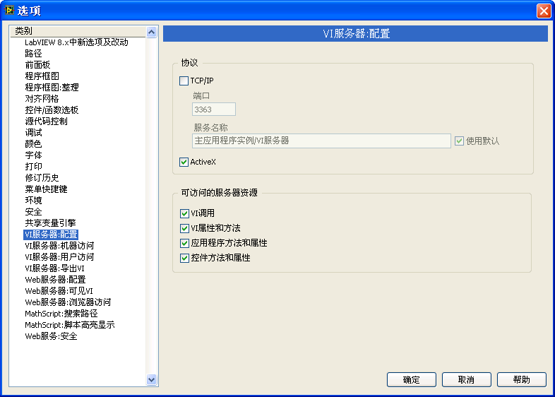
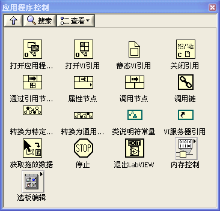

# VI服务器

## 概念

VI服务器（VI Server）是从LabVIEW
5.0开始提供的一个功能。它是由LabVIEW提供的、用以帮助用户通过编程来控制VI（包括VI上的控件、函数、子VI等）和LabVIEW环境设置等的一整套函数。

VI服务器的服务由LabVIEW提供，客户端可以通过三种方法调用服务器提供的服务：

客户端就是本机的LabVIEW程序：这是最常用的VI服务器使用方式。VI直接使用LabVIEW中的属性、调用等节点就可以利用VI服务器提供的服务了。这种方法也被称为VI
Scripting（VI脚本）。在LabVIEW程序中通过属性节点（Property
Node）和调用节点（Invoke Node）提供的属性与方法，就可以调用这些服务。VI
Scripting最常见于在运行时需要改变界面的程序，以及动态运行某个VI的程序。

ActiveX：如果希望在其它编程语言中使用VI服务器，可以利用LabVIEW提供的ActiveX接口，支持ActiveX的编程语言。比如VB、VC++等都可以调用LabVIEW提供的服务。

TCP/IP：用于远程机器。通过TCP/IP协议调用另一台计算机上LabVIEW提供的功能。

在LabVIEW的菜单中选择"工具-\>选项..."，可以设置是否以ActiveX和TCP/IP协议的方式提供VI服务（图
6.1）。

图 .1设置是否以ActiveX和TCP/IP协议的方式提供VI服务

## VI Scripting

VI
Scripting的主要功能是通过编程修改应用程序和LabVIEW的设置，也可以在程序运行时修改程序和界面控件的属性，调用它们的某些方法。VI
Scripting最常用的场合包括：在程序运行时改变程序界面，程序运行时装入子VI，控制另一线程代码的执行，批量创建或修改多个VI等。

与VI
Scripting相关的节点都在函数选板"编程-\>应用程序控制"中，这其中又以属性节点和调用节点使用得最为频繁（图
6.2）。

图 .2应用程序控制函数选板

VI Scripting的使用过程一般是这样的：

首先，打开一个VI或者某个对象的引用。比如可以使用"编程-\>应用程序控制-\>打开VI引用"函数来打开一个VI的引用，或者使用属性节点打开VI中某个控件的引用。

然后，使用属性节点设置这个对象的属性，或者使用调用节点调用这个对象的方法。

最后，使用"关闭引用"函数关闭所有被打开的节点。

VI
Scripting的一部分功能直接就可以在LabVIEW中使用。另外还有一些功能，如创建和修改VI的程序框图，在LabVIEW专业版中没有开放出来，需要另外从NI公司得到专门的许可后才能使用。
